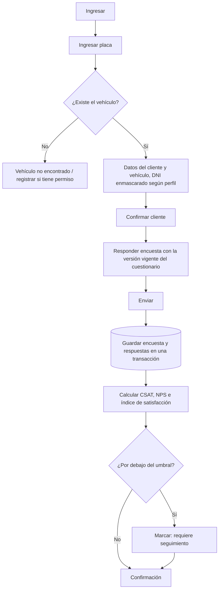
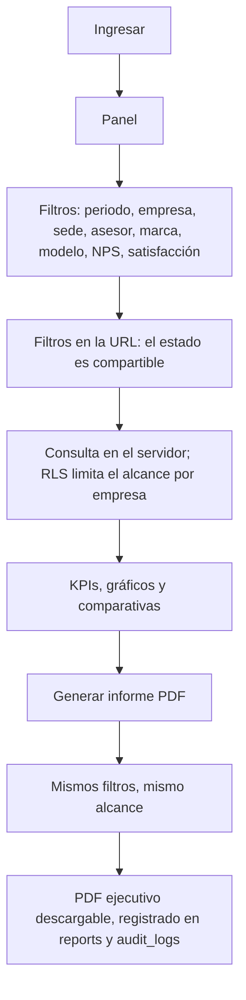
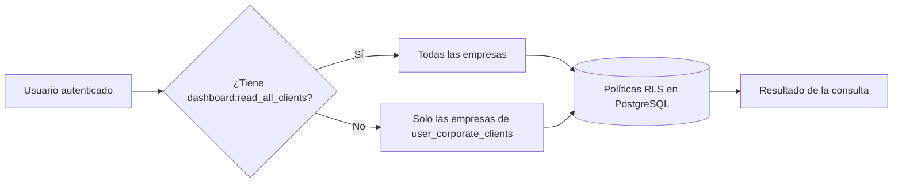

# 1. Arquitectura recomendada

## 1.1 Forma general

Una **aplicación Next.js monolítica y modular**, desplegada en Vercel, con
PostgreSQL gestionado en Supabase como única fuente de verdad.

```
Navegador / Tablet en taller
        │  HTTPS
┌───────▼──────────────────────────────────────────────┐
│ Vercel Edge (middleware: sesión + primera barrera)   │
├──────────────────────────────────────────────────────┤
│ Next.js App Router                                   │
│  · Server Components  → lectura de datos             │
│  · Server Actions     → escritura de datos           │
│  · Route Handlers     → PDF, salud, integraciones    │
│  · Client Components  → filtros, formularios, charts │
└───────┬──────────────────────────────────────────────┘
        │  PostgREST + JWT del usuario
┌───────▼──────────────────────────────────────────────┐
│ Supabase                                             │
│  · PostgreSQL + Row Level Security  ← frontera real  │
│  · Auth (JWT, refresh, recuperación)                 │
│  · Storage (logos corporativos, PDFs archivados)     │
└──────────────────────────────────────────────────────┘
```

No hay backend separado. En Next.js moderno el servidor **ya está ahí**: las
Server Actions y los Route Handlers *son* el backend, en el mismo repositorio y
con los mismos tipos. Un servicio Express aparte añadiría un despliegue, un
contrato HTTP que mantener y una duplicación de tipos, sin resolver ningún
problema que este sistema tenga.

## 1.2 Las cuatro capas

| Capa               | Dónde vive                  | Responsabilidad                                                      |
| ------------------ | --------------------------- | -------------------------------------------------------------------- |
| Presentación       | `src/app`, `src/components` | Render, estados loading/empty/error/success, accesibilidad            |
| Módulos de negocio | `src/features/<modulo>`     | Acciones, consultas, esquemas y reglas de cada dominio                |
| Infraestructura    | `src/lib`                   | Sesión, permisos, clientes Supabase, errores, entorno, formato        |
| Datos              | `db/`, PostgreSQL           | Esquema, migraciones, índices, políticas RLS, funciones de agregación |

La regla que sostiene todo: **la lógica de negocio de `features/*/services/` no
importa Next.js ni Supabase**. Calcular un CSAT, clasificar un NPS o decidir si
un cliente requiere seguimiento son funciones puras que reciben datos y
devuelven datos. Eso permite probarlas sin levantar la aplicación y reutilizarlas
tal cual en el generador de PDF.

## 1.3 Las tres decisiones que definen el sistema

**(a) La autorización se resuelve en la base de datos, no en la interfaz.**
Cada consulta viaja con el JWT del usuario y choca contra las políticas RLS de
PostgreSQL. Si mañana una consulta del panel olvidara filtrar por empresa, BBVA
seguiría sin poder ver datos de Mitsui: la base de datos lo impide. Ocultar
elementos en el frontend es solo comodidad visual; el permiso se verifica además
en cada Server Action antes de tocar nada.

**(b) La configuración del negocio vive en tablas, no en el código.**
Empresas, preguntas, escalas, umbrales de satisfacción, roles y permisos son
filas. El código lee ese catálogo. Añadir un sexto cliente corporativo o cambiar
el corte de "cliente insatisfecho" es una operación de administración, no un
despliegue. Las constantes que existen en el código
(`DEFAULT_ROLE_PERMISSIONS`, `DEFAULT_METRIC_SETTINGS`) son **semillas
reproducibles** del seed inicial y están marcadas como tales.

**(c) La encuesta es inmutable y versionada.**
Una encuesta enviada no se edita jamás. Y como el cuestionario puede cambiar con
el tiempo, cada encuesta apunta a la **versión** del cuestionario con la que se
respondió (`survey_template_versions`). Sin eso, editar una pregunta en 2027
corrompería retroactivamente la comparación histórica de 2026.

---

# 2. Tecnologías y justificación

| Capa           | Elección                            | Por qué esta y no otra                                                                                                                                                                                      |
| -------------- | ----------------------------------- | ----------------------------------------------------------------------------------------------------------------------------------------------------------------------------------------------------------- |
| Framework      | **Next.js 16 (App Router)**         | Los filtros del panel se resuelven en el servidor: el navegador nunca recibe filas que no le corresponden. Además es el runtime nativo de Vercel, sin capas de adaptación.                                    |
| Lenguaje       | **TypeScript estricto**             | `strict` + `noUncheckedIndexedAccess` + `verbatimModuleSyntax`. El compilador es la primera prueba de regresión del proyecto.                                                                                  |
| Estilos        | **Tailwind CSS v4**                 | Los tokens de diseño (color, radio, tipografía) se declaran una vez en `@theme` y generan utilidades. El CSS se compila con PostCSS y el bundle final solo contiene lo usado.                                  |
| Componentes    | **Propios sobre CVA**               | shadcn/ui copia código a tu repositorio igualmente; aquí se escriben directamente los primitivos necesarios con los tokens del sistema. Cero dependencia que versionar, cero estética de plantilla.            |
| Base de datos  | **PostgreSQL (Supabase)**           | El modelo es fuertemente relacional (empresa → cliente → vehículo → encuesta → respuesta) y necesita integridad referencial y agregaciones. Supabase aporta RLS, Auth y Storage sobre Postgres estándar.       |
| Esquema        | **Drizzle Kit**                     | Genera migraciones SQL legibles que se revisan en el pull request. Frente a Prisma: sin motor binario en la función serverless y sin penalización de arranque en frío.                                         |
| Acceso a datos | **`@supabase/ssr` + funciones SQL** | Cada consulta lleva el JWT y queda sujeta a RLS. Las agregaciones del panel se resuelven en funciones SQL (`security invoker`) que devuelven todos los KPIs en una llamada, con RLS todavía aplicada.          |
| Autenticación  | **Supabase Auth**                   | Misma plataforma que la base de datos: el `auth.uid()` del JWT es directamente utilizable dentro de las políticas RLS. Con Auth.js habría que propagar la identidad a Postgres a mano.                         |
| Validación     | **Zod v4**                          | Un solo esquema valida el formulario en el navegador y la Server Action en el servidor. El frontend informa; el servidor decide.                                                                                |
| Gráficos web   | **Recharts** (fase 9)               | Declarativo, SVG, buen soporte de tooltip e interacción. Las escalas se calculan con d3-scale y se comparten con el PDF.                                                                                       |
| PDF            | **`@react-pdf/renderer`** (fase 10) | Ver sección 9. Sin Chromium.                                                                                                                                                                                   |
| Despliegue     | **Vercel**                          | Ver sección 10.                                                                                                                                                                                                |

### Lo que se descartó, y por qué

- **Prisma**: excelente experiencia de desarrollo, pero añade peso de arranque en
  frío en funciones serverless y su capa propia complica convivir con RLS. Aquí
  el esquema se versiona en SQL y el acceso pasa por PostgREST.
- **Chromium/Puppeteer para PDF**: funciona, pero son ~50 MB de binario, varios
  segundos de arranque en frío y una fuente constante de fallos en producción.
- **Backend separado (NestJS/Express)**: un despliegue más, un contrato más y
  tipos duplicados, sin ganancia para este alcance.
- **MongoDB**: el dominio es relacional y los informes son agregaciones.
  PostgreSQL es la respuesta correcta.

---

# 3. Diagrama lógico del sistema

## 3.1 Flujo operativo (encuestador, tablet frente al cliente)



## 3.2 Flujo analítico (analista o cliente corporativo)



## 3.3 Alcance de datos por perfil



---

# 9. Estrategia de generación de PDF

## 9.1 Decisión

**`@react-pdf/renderer` ejecutado en un Route Handler con runtime Node.js**, sin
navegador headless.

| Criterio               | react-pdf                    | Chromium headless                      |
| ---------------------- | ---------------------------- | -------------------------------------- |
| Tamaño del despliegue  | librería JS                  | ~50 MB de binario                      |
| Arranque en frío       | despreciable                 | 2–5 s                                  |
| Calidad de impresión   | vectorial nativo             | depende del rasterizado del motor      |
| Control de paginación  | explícito (`break`, `fixed`) | reglas CSS de impresión, frágiles      |
| Fallos en producción   | raros                        | frecuentes (memoria, sandbox, fuentes) |

El informe se envía a gerentes de MG, Mitsui, Relsa, Invetsa y BBVA, y debe
verse igual de bien impreso que en pantalla. Un PDF vectorial no se pixela al
imprimir: esa es la razón de fondo.

## 9.2 Los gráficos dentro del PDF

`react-pdf` no renderiza Recharts, pero sí tiene primitivos SVG. Por eso la capa
de gráficos se parte en dos:

```
features/analytics/services/chart-geometry.ts   ← escalas y rutas (d3-scale, d3-shape)
        ├── web  → <Recharts …>                  (interactivo, con tooltip)
        └── pdf  → <Svg><Path d={…}/></Svg>      (vectorial, impresión)
```

La **geometría se calcula una sola vez** y se dibuja con el renderizador que
corresponda. El gráfico del PDF no es una captura del panel: es el mismo dato
compuesto para papel.

## 9.3 Recorrido de una generación

1. `POST /api/reports/satisfaction` recibe los filtros, validados **con el mismo
   esquema Zod que usa el panel**.
2. Se verifica sesión y permiso `reports:generate`.
3. Se resuelve el alcance corporativo: si el usuario es BBVA, la consulta se
   limita a BBVA en el código **y** RLS lo vuelve a limitar en la base de datos.
4. Se ejecuta la misma función SQL de agregación que alimenta el panel: **el PDF
   nunca puede contradecir la pantalla** porque leen del mismo sitio.
5. Fortalezas, oportunidades, conclusiones y recomendaciones se derivan por
   reglas a partir de los indicadores (preguntas mejor y peor calificadas,
   variación contra el periodo anterior, proporción de detractores). Son
   deterministas y auditables.
6. Los comentarios se incluyen sin nombre ni documento del cliente.
7. Se transmite el PDF con `Content-Disposition: attachment` y nombre automático
   `Informe_Satisfaccion_BBVA_Agosto_2026.pdf`.
8. Se registra la generación en `reports` y en `audit_logs` (quién, cuándo, con
   qué filtros, desde qué IP).

`maxDuration: 60` y 1769 MB para esa ruta en `vercel.json`. Si un informe
superara ese tiempo, el camino correcto es precalcular el periodo en una vista
materializada, no subir el límite.

---

# 10. Estrategia de despliegue en Vercel

## 10.1 Entornos

| Entorno    | Rama     | Base de datos               | Datos             |
| ---------- | -------- | --------------------------- | ----------------- |
| Desarrollo | local    | proyecto Supabase `dev`     | catálogo + DEMO   |
| Preview    | cada PR  | proyecto Supabase `staging` | catálogo + DEMO   |
| Producción | `main`   | proyecto Supabase `prod`    | solo datos reales |

`ENABLE_DEMO_DATA=false` en producción. Los registros DEMO llevan además
`is_demo = true` en la propia fila, de modo que el panel puede excluirlos siempre
y ninguna consulta los mezcla con datos reales.

## 10.2 Región

Función y base de datos deben estar juntas. Con usuarios en Lima, la
configuración es proyecto Supabase en **`sa-east-1` (São Paulo)** y funciones
Vercel en **`gru1`**, ya fijado en `vercel.json`. Separarlas añadiría cerca de
150 ms de ida y vuelta a cada consulta del panel, que hace varias.

## 10.3 Variables de entorno

Se cargan en Vercel por entorno, nunca en el repositorio.
`SUPABASE_SERVICE_ROLE_KEY` y `DOCUMENT_HASH_SECRET` existen solo como variables
de servidor. El arranque las valida con Zod: un despliegue mal configurado falla
de inmediato y de forma explícita, en vez de romperse a mitad de una encuesta.

## 10.4 Integración continua

```
PR abierto
 ├── npm run typecheck        (tsc --noEmit)
 ├── npm run lint
 ├── npm run build
 ├── drizzle-kit check        (detecta migraciones divergentes)
 └── Vercel Preview + Supabase staging
merge a main
 ├── migraciones aplicadas por el workflow (no a mano, no desde el panel web)
 └── despliegue de producción
```

Las migraciones se aplican **antes** del despliegue y siempre hacia adelante: una
columna se añade opcional, se rellena, y solo entonces se vuelve obligatoria.
Nunca hay una ventana en la que el código nuevo espere un esquema que aún no
existe.

## 10.5 Operación

- `/api/health` responde sin sesión, para monitoreo externo.
- Logs estructurados en JSON, filtrables por evento y usuario mediante Log Drain.
- Copias de seguridad diarias con recuperación a un punto en el tiempo (PITR).
- Los PDFs generados se archivan en Supabase Storage con enlaces firmados de
  caducidad corta, nunca públicos.
