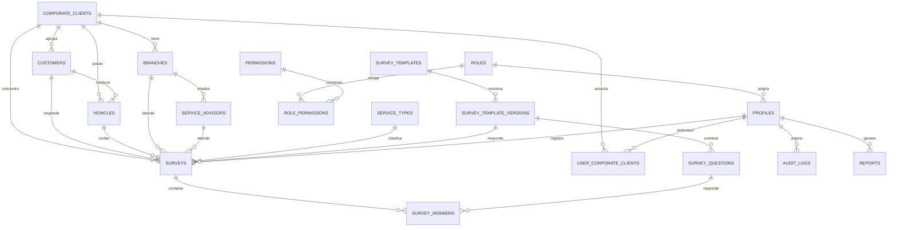

# 4. Modelo inicial de base de datos

Diseño objetivo de la **FASE 2**. Aquí se fija el contrato; el SQL se genera en
esa fase con `drizzle-kit`.

## 4.1 Diagrama entidad-relación



## 4.2 Tablas

### Organización

**`corporate_clients`** — MG, Mitsui, Relsa, Invetsa, BBVA y los que vengan.
`id uuid pk` · `code citext unique` · `name` · `legal_name` · `tax_id` ·
`logo_path` (Storage, para la portada del PDF) · `brand_color` · `is_active` ·
`created_at` · `updated_at` · `deleted_at`

**`branches`** — sedes/talleres.
`id` · `corporate_client_id fk` *(nullable: una sede propia no pertenece a un
cliente corporativo)* · `code` · `name` · `city` · `is_active`

**`service_advisors`** — asesores de servicio.
`id` · `branch_id fk` · `full_name` · `document_number` · `is_active`

**`service_types`** — mantenimiento preventivo, correctivo, garantía, planchado…
`id` · `code` · `name` · `is_active`

### Personas y vehículos

**`customers`**
`id` · `corporate_client_id fk` · `document_type` (`DNI` \| `CE` \| `RUC` \|
`PAS`) · `document_number` *(acceso restringido, ver 4.4)* ·
`document_last3 generated` · `document_hash` *(HMAC-SHA256 para buscar sin
exponer)* · `first_name` · `last_name` · `email` · `phone` · `is_demo` ·
`created_at` · `updated_at` · `deleted_at`
→ `unique (document_type, document_number)`

**`vehicles`**
`id` · `corporate_client_id fk` · `primary_customer_id fk` ·
`plate citext unique` *(normalizada: sin guiones, mayúsculas)* · `brand` ·
`model` · `model_year` · `vin` · `internal_number` *(número interno de flota)* ·
`last_service_at` · `is_demo` · `created_at` · `updated_at` · `deleted_at`

> **Una persona, varios vehículos**: la relación va por `primary_customer_id`.
> Cuando un vehículo cambia de conductor, el historial no se pierde: cada
> encuesta guarda su propio `customer_id`, de modo que una encuesta de 2026 sigue
> apuntando a quien realmente la respondió.

### Cuestionario

**`survey_templates`** — `id` · `code` · `name` · `is_active`

**`survey_template_versions`** — `id` · `template_id fk` · `version int` ·
`published_at` · `is_current`
→ Publicar una versión nueva **congela** la anterior. Las encuestas viejas
siguen apuntando a la suya.

**`survey_questions`** — `id` · `template_version_id fk` · `code` · `text` ·
`type` (`scale_1_5`, `scale_0_10`, `yes_no`, `single_choice`, `multiple_choice`,
`free_text`) · `options jsonb` · `position` · `is_required` ·
`weight numeric(5,2)` · `metric_role` (`csat`, `nps`, `none`)

> `metric_role` es lo que evita cablear números de pregunta en el código: el
> cálculo del NPS busca la pregunta marcada como `nps`, no "la pregunta 9".

### Encuestas

**`surveys`**
`id` · `code` *(legible: `ENC-2026-000128`)* · `template_version_id fk` ·
`corporate_client_id fk` · `customer_id fk` · `vehicle_id fk` · `branch_id fk` ·
`service_advisor_id fk` · `service_type_id fk` · `work_order` · `mileage` ·
`created_by fk profiles` · `status` (`completed` \| `voided`) ·
`csat_score numeric(5,2)` · `nps_score int` · `nps_category` ·
`satisfaction_index numeric(5,2)` · `satisfaction_level` ·
`requires_followup boolean` · `followup_status` · `comments text` · `is_demo` ·
`answered_at` · `created_at` · `updated_at`

> Los indicadores se **almacenan calculados**. Recalcularlos en cada carga del
> panel obligaría a recorrer millones de respuestas; y además un cambio futuro de
> umbrales no debe reescribir la historia ya reportada a un cliente.

**`survey_answers`**
`id` · `survey_id fk` · `question_id fk` · `value_numeric` · `value_text` ·
`value_options jsonb` · `created_at`
→ `unique (survey_id, question_id)`

### Seguridad y trazabilidad

**`profiles`** — extiende `auth.users`.
`id uuid pk fk auth.users` · `role_id fk` · `full_name` · `email` ·
`branch_id fk` · `is_active` · `last_login_at`

**`user_corporate_clients`** — `user_id fk` + `corporate_client_id fk`
→ **Es la tabla de la que depende todo el aislamiento entre empresas.** Un
usuario de BBVA solo tiene aquí la fila de BBVA.

**`roles`** · **`permissions`** · **`role_permissions`** — RBAC administrable.

**`app_settings`** — `key` · `value jsonb` · `scope` (global o por empresa) ·
`updated_by` · `updated_at`
→ Nombre del sistema, umbrales de satisfacción, cortes de NPS, disparadores de
seguimiento, plantilla del PDF.

**`reports`** — `id` · `corporate_client_id fk` · `generated_by fk` ·
`filters jsonb` · `period_start` · `period_end` · `file_path` · `created_at`

**`audit_logs`** — `id` · `actor_id fk` · `action` · `entity` · `entity_id` ·
`diff jsonb` · `ip inet` · `user_agent` · `created_at`

## 4.3 Índices

Pensados a partir de las consultas que el sistema hace de verdad:

| Índice                                                                | Consulta que resuelve                        |
| --------------------------------------------------------------------- | -------------------------------------------- |
| `vehicles (plate)` único                                              | búsqueda por placa — la pantalla inicial      |
| `customers (document_hash)`                                           | búsqueda por DNI sin exponer el número        |
| `customers (last_name, first_name)`                                   | buscador global por nombre                    |
| `surveys (corporate_client_id, answered_at DESC)`                     | panel filtrado por empresa y periodo          |
| `surveys (answered_at DESC)`                                          | tendencias globales                           |
| `surveys (vehicle_id, answered_at DESC)`                              | historial del vehículo                        |
| `surveys (requires_followup) WHERE requires_followup` *(parcial)*     | "clientes que requieren atención"             |
| `surveys (branch_id, answered_at)` · `(service_advisor_id, answered_at)` | comparativas por sede y asesor              |
| `survey_answers (survey_id)`                                          | carga de una encuesta                         |
| `survey_answers (question_id, value_numeric)`                         | satisfacción por pregunta                     |
| `audit_logs (entity, entity_id, created_at DESC)`                     | trazabilidad de un registro                   |

Índices parciales `WHERE deleted_at IS NULL` en las tablas con borrado lógico:
las filas eliminadas no deben pesar en el índice.

## 4.4 Protección del documento de identidad

Tres columnas en lugar de una:

| Columna            | Uso                                  | Quién la ve                      |
| ------------------ | ------------------------------------ | -------------------------------- |
| `document_number`  | número completo                      | solo `customers:read_pii`        |
| `document_last3`   | últimos 3 dígitos (generada)         | cualquiera que pueda ver clientes |
| `document_hash`    | HMAC-SHA256 con `DOCUMENT_HASH_SECRET` | nadie: solo se compara internamente |

La interfaz consume la vista `customers_masked`, que devuelve `•••••123`. El
número completo se sirve únicamente por una función `security definer` que
verifica el permiso y **deja constancia en `audit_logs`**. Buscar por DNI no
requiere leer el número: se compara el hash.

## 4.5 Aislamiento entre empresas (RLS)

Cada tabla con datos de negocio tiene una política del mismo patrón:

```sql
create policy surveys_select on surveys for select
using (
  has_permission(auth.uid(), 'dashboard:read_all_clients')
  or corporate_client_id in (
    select corporate_client_id from user_corporate_clients where user_id = auth.uid()
  )
);
```

Consecuencia práctica: aunque un error de programación olvidara el filtro por
empresa, un usuario de BBVA recibiría cero filas de Mitsui. **El aislamiento no
depende de que el código esté bien escrito.**

## 4.6 Cálculo de indicadores

Definiciones fijadas aquí para que panel, PDF y API no puedan divergir:

- **CSAT** = respuestas ≥ 4 (escala 1–5) ÷ respuestas válidas × 100.
- **NPS** = % promotores (9–10) − % detractores (0–6). Rango −100 a 100.
- **Índice de satisfacción** = promedio ponderado de las preguntas de escala,
  normalizado a 0–100 con los pesos de `survey_questions.weight`.
- **Nivel**: 0–49 insatisfecho · 50–69 regular · 70–84 satisfecho ·
  85–100 muy satisfecho.
- **Requiere seguimiento**: alguna respuesta de escala ≤ 2/5 **o** NPS ≤ 6.

Todos los cortes se leen de `app_settings`; los valores anteriores son solo la
semilla inicial.

## 4.7 Cuestionario base (del documento Word del proyecto)

| # | Pregunta                                                    | Tipo         | Rol métrico |
| - | ----------------------------------------------------------- | ------------ | ----------- |
| 1 | ¿Qué tan satisfecho quedó con la atención recibida?          | `scale_1_5`  | csat        |
| 2 | ¿Cómo calificaría la amabilidad y cordialidad del personal?  | `scale_1_5`  | csat        |
| 3 | ¿La explicación del servicio o reparación fue clara?         | `scale_1_5`  | csat        |
| 4 | ¿Qué tan satisfecho está con el tiempo de atención o entrega?| `scale_1_5`  | csat        |
| 5 | ¿Qué tan satisfecho quedó con la calidad del trabajo?        | `scale_1_5`  | csat        |
| 6 | ¿Los costos finales fueron claros y acordes a lo informado?  | `scale_1_5`  | csat        |
| 7 | ¿Qué nivel de confianza le genera nuestra empresa?           | `scale_1_5`  | csat        |
| 8 | En general, ¿qué tan satisfecho está con su experiencia?     | `scale_1_5`  | csat        |
| 9 | Del 0 al 10, ¿qué tan probable es que nos recomiende?        | `scale_0_10` | nps         |
| 10| ¿Volvería a utilizar nuestros servicios?                     | `single_choice` (Sí / Tal vez / No) | none |
| — | Comentario o sugerencia                                      | `free_text`  | none        |

Se carga como `survey_templates.code = 'automotriz-base'`, versión 1, mediante
`npm run db:seed:catalog`. Cualquier cambio posterior se hace desde el panel de
administración y genera una versión nueva.
