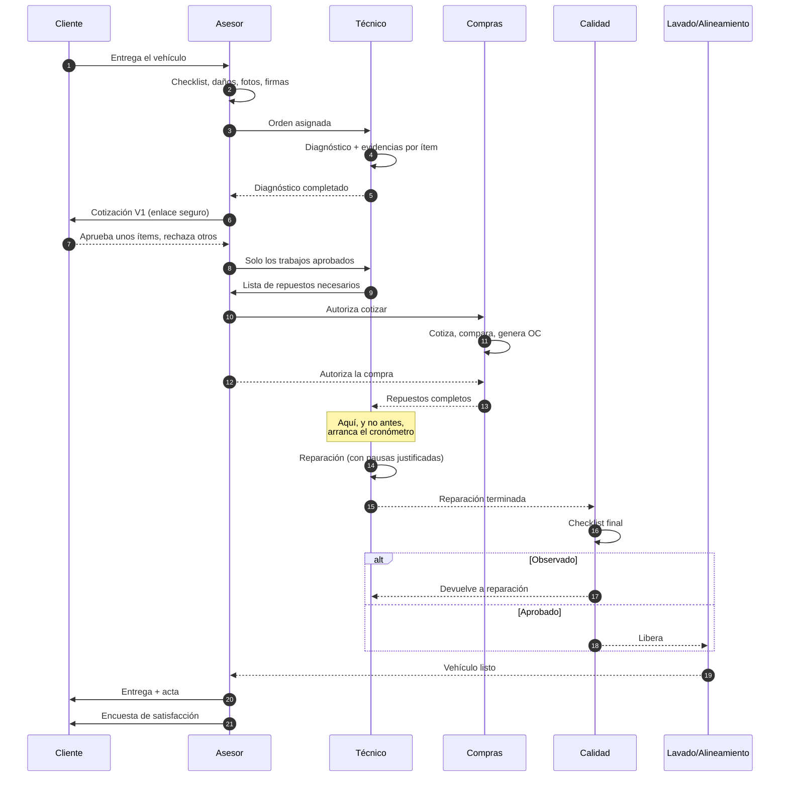
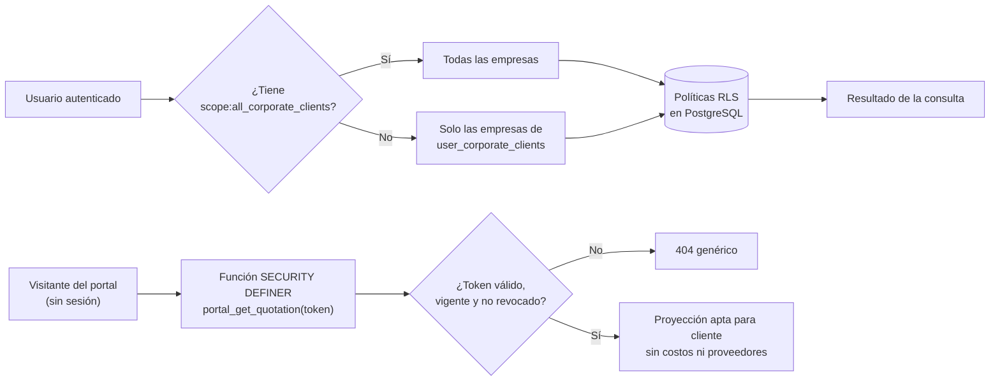

# 2. Diagrama del flujo operativo

## 2.1 Recorrido completo

```mermaid
flowchart TD
    A["Llega el vehículo"] --> B["Asesor: recepción<br/>cliente · vehículo · kilometraje"]
    B --> C["Checklist digital<br/>interiores · exteriores · funciones · niveles"]
    C --> D["Diagrama de daños<br/>+ fotografías"]
    D --> E["Firma del cliente y del asesor"]
    E --> F["ORDEN DE SERVICIO<br/>OS-2026-000154"]
    F --> G["Tipo de servicio<br/>preventivo · correctivo · planchado y pintura"]
    G --> H["Asignación: técnico · bahía · prioridad"]

    H --> I["Técnico: diagnóstico"]
    I --> J["Ítems de diagnóstico<br/>sistema · hallazgo · trabajo · prioridad · horas"]
    J --> K["Evidencias por ítem<br/>fotos · vídeos · documentos"]
    K --> L["Diagnóstico completado → avisa al asesor"]

    L --> M["Asesor: cotización V1<br/>una fila por ítem, independiente"]
    M --> N["Enlace seguro al cliente"]
    N --> O["Cliente decide ítem por ítem"]

    O --> P{"¿Algún ítem aprobado?"}
    P -- No --> Z1["Cerrar sin trabajos<br/>→ listo para entrega"]
    P -- Sí --> Q["Solo los aprobados vuelven al técnico<br/>los rechazados quedan bloqueados"]

    Q --> R{"¿Necesita repuestos?"}
    R -- No --> W["Listo para reparación"]
    R -- Sí --> S["Técnico: lista de repuestos<br/>solo de trabajos aprobados"]
    S --> T["Asesor autoriza cotizar"]
    T --> U["Compras: cotiza a proveedores<br/>y compara"]
    U --> V["Autorización de compra → OC-2026-000045"]
    V --> V2["Recepción parcial o total"]
    V2 --> V3{"¿Cantidades completas?"}
    V3 -- No --> V2
    V3 -- Sí --> W

    W --> X["Técnico: INICIAR TRABAJO<br/>arranca el cronómetro"]
    X --> X2{"¿Aparece trabajo adicional?"}
    X2 -- Sí --> M2["Cotización V2 · pausa automática"]
    M2 --> N
    X2 -- No --> Y["Reparación terminada<br/>+ evidencias finales"]

    Y --> AA["Control de calidad"]
    AA --> AB{"¿Aprueba?"}
    AB -- No --> X
    AB -- Sí --> AC["Servicios finales según configuración"]
    AC --> AD["Lavado y/o alineamiento"]
    AD --> AE["VEHÍCULO LISTO → notifica al asesor"]
    AE --> AF["Entrega + acta"]
    AF --> AG["Cierre de orden"]
    AG --> AH["Encuesta de satisfacción"]
    AH --> AI["Panel · analítica · informe PDF"]

    Z1 --> AF
```

## 2.2 El mismo recorrido, por responsable

## 2.3 Los cuatro momentos que el sistema debe medir bien

El recorrido tiene decenas de eventos, pero solo cuatro instantes explican casi
toda la diferencia entre un taller que cumple y uno que no:

| Instante | Estado que lo marca | Qué mide el intervalo anterior |
| --- | --- | --- |
| **Diagnóstico completado** | `DIAGNOSTICO_COMPLETADO` | Capacidad técnica de responder rápido |
| **El cliente decidió** | `APROBADO` / `APROBACION_PARCIAL` | Calidad de la comunicación comercial |
| **Repuestos completos** | `REPUESTOS_COMPLETOS` | Desempeño de la cadena de compras |
| **Reparación terminada** | `REPARACION_TERMINADA` | Productividad real del técnico |

Estos cuatro cortes son la razón de ser de `status_history` y de la separación
estricta entre tiempo de taller y tiempo de técnico. **El cronómetro del técnico
no corre mientras se espera al cliente ni mientras se esperan repuestos** — si
corriera, un técnico impecable en un taller con compras lentas aparecería como
improductivo, y el indicador serviría para lo contrario de lo que se pretende.

## 2.4 Alcance de datos por perfil

