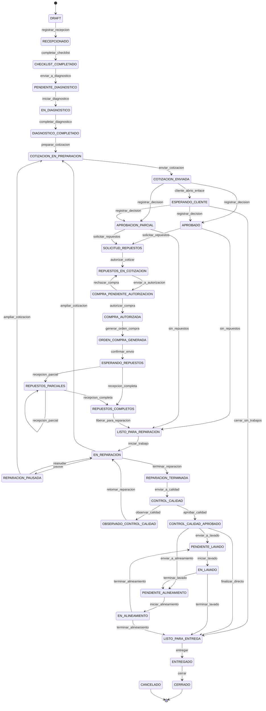

# 3. Máquina de estados de la orden de servicio

## 3.1 Principio

`service_orders.status` **no es un campo de texto**. Es el estado de una máquina
con transiciones explícitas. Ninguna pantalla escribe el estado directamente:
invoca una transición, y la transición comprueba tres cosas antes de aplicarse.

```
canTransition(orden, accion, actor) =
      1. la acción está declarada para el estado actual      → InvalidTransitionError
   ∧  2. el actor tiene el permiso que la acción exige       → ForbiddenError
   ∧  3. se cumplen las guardas de negocio de la acción      → BusinessRuleError
```

Las tres devuelven errores distintos **a propósito**: "no puedes ahora", "no
puedes tú" y "faltan datos" son problemas diferentes y el usuario necesita
saber cuál tiene.

La definición vive en `src/features/orders/services/state-machine.ts`, es
**TypeScript puro** y se prueba sin base de datos. La misma tabla alimenta:

- la validación en el servidor (la que manda);
- la habilitación de botones en la interfaz (comodidad);
- un `CHECK` y un disparador en PostgreSQL (la red de seguridad definitiva).

## 3.2 Los 34 estados, agrupados

| Grupo | Estados | Quién actúa |
| --- | --- | --- |
| **Recepción** | `DRAFT` · `RECEPCIONADO` · `CHECKLIST_COMPLETADO` | Asesor |
| **Diagnóstico** | `PENDIENTE_DIAGNOSTICO` · `EN_DIAGNOSTICO` · `DIAGNOSTICO_COMPLETADO` | Técnico |
| **Comercial** | `COTIZACION_EN_PREPARACION` · `COTIZACION_ENVIADA` · `ESPERANDO_CLIENTE` · `APROBACION_PARCIAL` · `APROBADO` | Asesor / Cliente |
| **Abastecimiento** | `SOLICITUD_REPUESTOS` · `REPUESTOS_EN_COTIZACION` · `COMPRA_PENDIENTE_AUTORIZACION` · `COMPRA_AUTORIZADA` · `ORDEN_COMPRA_GENERADA` · `ESPERANDO_REPUESTOS` · `REPUESTOS_PARCIALES` · `REPUESTOS_COMPLETOS` | Compras |
| **Taller** | `LISTO_PARA_REPARACION` · `EN_REPARACION` · `REPARACION_PAUSADA` · `REPARACION_TERMINADA` | Técnico |
| **Calidad** | `CONTROL_CALIDAD` · `OBSERVADO_CONTROL_CALIDAD` · `CONTROL_CALIDAD_APROBADO` | Calidad |
| **Servicios finales** | `PENDIENTE_LAVADO` · `EN_LAVADO` · `PENDIENTE_ALINEAMIENTO` · `EN_ALINEAMIENTO` | Lavado / Alineamiento |
| **Cierre** | `LISTO_PARA_ENTREGA` · `ENTREGADO` · `CERRADO` | Asesor |
| **Terminal** | `CANCELADO` | Asesor / Admin |

Estados terminales: `CERRADO` y `CANCELADO`. No sale ninguna transición de ellos.

## 3.3 Diagrama



> `cancelar` está disponible desde **cualquier** estado anterior a `ENTREGADO` y
> se omite del diagrama para no convertirlo en una maraña.

## 3.4 Tabla de transiciones

`▸` = la acción puede desembocar en más de un estado según las guardas.

| # | Desde | Acción | Hacia | Permiso | Guarda |
| --- | --- | --- | --- | --- | --- |
| 1 | `DRAFT` | `registrar_recepcion` | `RECEPCIONADO` | `orders:create` | Cliente y vehículo identificados |
| 2 | `RECEPCIONADO` | `completar_checklist` | `CHECKLIST_COMPLETADO` | `receptions:write` | Todos los ítems obligatorios resueltos · niveles registrados · firmas de cliente y asesor |
| 3 | `CHECKLIST_COMPLETADO` | `enviar_a_diagnostico` | `PENDIENTE_DIAGNOSTICO` | `orders:assign` | Tipo de servicio definido |
| 4 | `PENDIENTE_DIAGNOSTICO` | `iniciar_diagnostico` | `EN_DIAGNOSTICO` | `diagnostics:write` | Hay técnico asignado **y** el actor es ese técnico |
| 5 | `EN_DIAGNOSTICO` | `completar_diagnostico` | `DIAGNOSTICO_COMPLETADO` | `diagnostics:write` | ≥ 1 ítem de diagnóstico con trabajo recomendado y horas estimadas |
| 6 | `DIAGNOSTICO_COMPLETADO` | `preparar_cotizacion` | `COTIZACION_EN_PREPARACION` | `quotations:write` | — |
| 7 | `COTIZACION_EN_PREPARACION` | `enviar_cotizacion` | `COTIZACION_ENVIADA` | `quotations:send` | ≥ 1 línea · todas con precio · versión cerrada · enlace emitido |
| 8 | `COTIZACION_ENVIADA` | `cliente_abrio_enlace` | `ESPERANDO_CLIENTE` | *(sistema)* | Token válido y vigente |
| 9 ▸ | `COTIZACION_ENVIADA`, `ESPERANDO_CLIENTE` | `registrar_decision` | `APROBADO` | *(portal)* o `authorizations:register` | Todos los ítems decididos **y** ninguno rechazado |
| 10 ▸ | idem | `registrar_decision` | `APROBACION_PARCIAL` | idem | Todos decididos · ≥ 1 aprobado · ≥ 1 rechazado |
| 11 | `ESPERANDO_CLIENTE` | `cerrar_sin_trabajos` | `LISTO_PARA_ENTREGA` | `orders:close_empty` | Todos decididos **y** 0 aprobados |
| 12 | `APROBADO`, `APROBACION_PARCIAL` | `solicitar_repuestos` | `SOLICITUD_REPUESTOS` | `parts:request` | ≥ 1 repuesto requerido por trabajos **aprobados** |
| 13 | `APROBADO`, `APROBACION_PARCIAL` | `sin_repuestos` | `LISTO_PARA_REPARACION` | `parts:request` | 0 repuestos requeridos |
| 14 | `SOLICITUD_REPUESTOS` | `autorizar_cotizar` | `REPUESTOS_EN_COTIZACION` | `parts:authorize_quote` | Solicitud en estado `pendiente` |
| 15 | `REPUESTOS_EN_COTIZACION` | `enviar_a_autorizacion` | `COMPRA_PENDIENTE_AUTORIZACION` | `purchases:quote` | Cada línea con proveedor seleccionado |
| 16 | `COMPRA_PENDIENTE_AUTORIZACION` | `autorizar_compra` | `COMPRA_AUTORIZADA` | `purchases:authorize` | Monto dentro del límite del autorizador |
| 17 | `COMPRA_PENDIENTE_AUTORIZACION` | `rechazar_compra` | `REPUESTOS_EN_COTIZACION` | `purchases:authorize` | Motivo obligatorio |
| 18 | `COMPRA_AUTORIZADA` | `generar_orden_compra` | `ORDEN_COMPRA_GENERADA` | `purchases:write` | — |
| 19 | `ORDEN_COMPRA_GENERADA` | `confirmar_envio` | `ESPERANDO_REPUESTOS` | `purchases:write` | OC emitida al proveedor |
| 20 | `ESPERANDO_REPUESTOS`, `REPUESTOS_PARCIALES` | `recepcion_parcial` | `REPUESTOS_PARCIALES` | `purchases:receive` | 0 < cobertura < 1 |
| 21 | `ESPERANDO_REPUESTOS`, `REPUESTOS_PARCIALES` | `recepcion_completa` | `REPUESTOS_COMPLETOS` | `purchases:receive` | cobertura = 1 sobre trabajos aprobados |
| 22 | `REPUESTOS_COMPLETOS` | `liberar_para_reparacion` | `LISTO_PARA_REPARACION` | *(sistema)* | — |
| 23 | `LISTO_PARA_REPARACION` | `iniciar_trabajo` | `EN_REPARACION` | `repairs:execute` | El actor es el técnico asignado · tiempo estimado confirmado |
| 24 | `EN_REPARACION` | `pausar` | `REPARACION_PAUSADA` | `repairs:execute` | Motivo de pausa del catálogo |
| 25 | `REPARACION_PAUSADA` | `reanudar` | `EN_REPARACION` | `repairs:execute` | — |
| 26 | `EN_REPARACION`, `REPARACION_PAUSADA` | `ampliar_cotizacion` | `COTIZACION_EN_PREPARACION` | `quotations:write` | Pausa automática con motivo `espera_autorizacion` |
| 27 | `EN_REPARACION` | `terminar_reparacion` | `REPARACION_TERMINADA` | `repairs:execute` | Todos los trabajos aprobados marcados como hechos · evidencia final adjunta · sin sesión de tiempo abierta |
| 28 | `REPARACION_TERMINADA` | `enviar_a_calidad` | `CONTROL_CALIDAD` | `repairs:execute` | — |
| 29 | `CONTROL_CALIDAD` | `aprobar_calidad` | `CONTROL_CALIDAD_APROBADO` | `quality:approve` | Checklist de calidad completo |
| 30 | `CONTROL_CALIDAD` | `observar_calidad` | `OBSERVADO_CONTROL_CALIDAD` | `quality:approve` | ≥ 1 hallazgo descrito |
| 31 | `OBSERVADO_CONTROL_CALIDAD` | `retomar_reparacion` | `EN_REPARACION` | `repairs:execute` | — |
| 32 ▸ | `CONTROL_CALIDAD_APROBADO` | `enviar_a_lavado` / `enviar_a_alineamiento` / `finalizar_directo` | `PENDIENTE_LAVADO` / `PENDIENTE_ALINEAMIENTO` / `LISTO_PARA_ENTREGA` | `orders:advance` | Resuelto por la configuración de etapas finales (§3.5) |
| 33 | `PENDIENTE_LAVADO` | `iniciar_lavado` | `EN_LAVADO` | `washing:execute` | — |
| 34 ▸ | `EN_LAVADO` | `terminar_lavado` | siguiente etapa pendiente o `LISTO_PARA_ENTREGA` | `washing:execute` | — |
| 35 | `PENDIENTE_ALINEAMIENTO` | `iniciar_alineamiento` | `EN_ALINEAMIENTO` | `alignment:execute` | — |
| 36 ▸ | `EN_ALINEAMIENTO` | `terminar_alineamiento` | siguiente etapa pendiente o `LISTO_PARA_ENTREGA` | `alignment:execute` | — |
| 37 | `LISTO_PARA_ENTREGA` | `entregar` | `ENTREGADO` | `orders:deliver` | Acta de entrega firmada |
| 38 | `ENTREGADO` | `cerrar` | `CERRADO` | `orders:close` | Sin saldos ni tareas abiertas |
| 39 | *cualquiera antes de* `ENTREGADO` | `cancelar` | `CANCELADO` | `orders:cancel` | Motivo obligatorio |

## 3.5 Etapas finales: por qué no son transiciones fijas

§37 pide que la secuencia final sea configurable: lavado, alineamiento, ambos, o
directo a finalizado. Cablear eso en la máquina de estados obligaría a tocar
código cada vez que cambie la política del taller.

En su lugar, cada orden resuelve al aprobar calidad una **lista ordenada de
etapas finales** desde `service_type_final_stages` (administrable), y la guarda
en `service_orders.final_stages`:

```ts
// Pura, determinista, probada.
nextFinalStage(pendientes) → 'lavado' | 'alineamiento' | null
// null  ⇒ LISTO_PARA_ENTREGA
```

Las transiciones 32, 34 y 36 consultan esa función. Añadir mañana una etapa
"control de torque" es una fila nueva y un caso más en el resolvedor, no una
reescritura de la máquina.

## 3.6 Lo que la máquina de estados deliberadamente NO controla

Tres flujos tienen ciclo de vida propio y **no mueven** el estado de la orden.
Mezclarlos produciría estados imposibles de mantener:

| Flujo | Su propio estado | Por qué está fuera |
| --- | --- | --- |
| Solicitud de repuestos | `parts_requests.status`: `borrador` → `pendiente` → `autorizada` \| `rechazada` \| `en_correccion` | §26 permite *solicitar corrección*. Si eso moviera la orden, cada ida y vuelta ensuciaría la línea de tiempo del vehículo |
| Autorización por ítem | `authorization_items.status`: `pendiente` → `aprobado` \| `rechazado` \| `aprobado_con_observacion` | §20 exige decisión **por fila**. El estado de la orden es el *resumen* de esas filas, no su reemplazo |
| Recepción de repuestos | cantidades en `purchase_receipt_items` | La cobertura se **calcula**; el estado de la orden solo refleja el resultado (§10) |

En los tres casos el estado de la orden es una **proyección** de un detalle más
fino. La regla general: si algo puede ir y volver varias veces, su estado vive
en su propia tabla.

## 3.7 Triple validación

| Capa | Qué hace | Si falla |
| --- | --- | --- |
| Interfaz | Deshabilita las acciones no disponibles y explica por qué | Comodidad; no es control de acceso |
| Server Action | `assertTransition()` antes de tocar nada | `InvalidTransitionError` / `ForbiddenError` / `BusinessRuleError` |
| PostgreSQL | Disparador `service_orders_status_guard` valida `(anterior, nuevo)` contra `status_transitions` y escribe `status_history` | `raise exception` — ni siquiera `psql` puede saltarse el grafo |

El disparador existe porque los *scripts* de corrección y las migraciones
también son código, y también se equivocan. Es la única forma de que la línea de
tiempo del vehículo esté completa **por construcción**.
