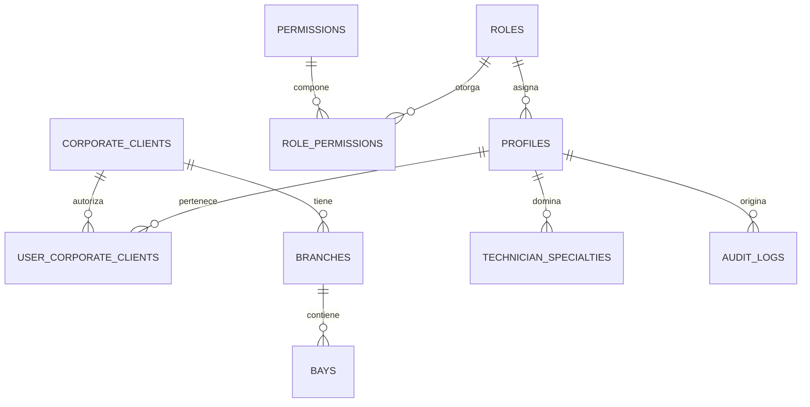
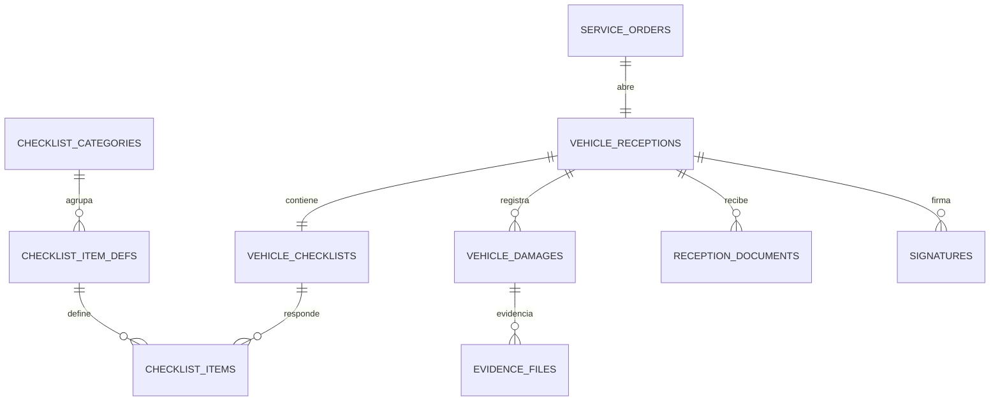
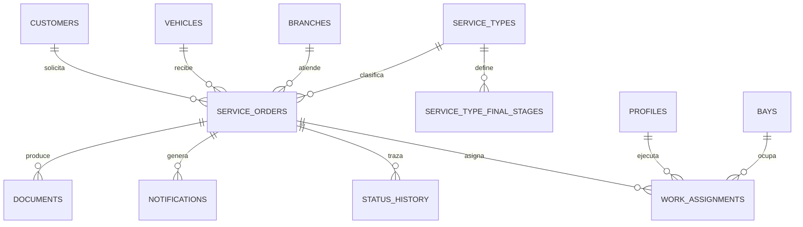
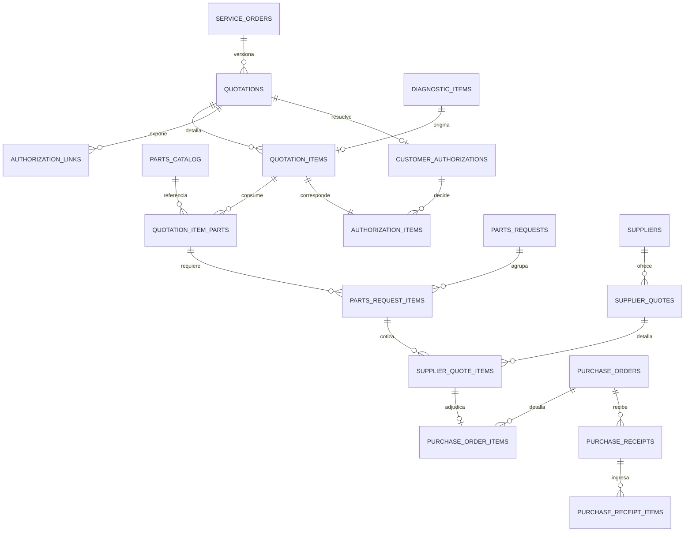

# 4. Modelo de base de datos y relaciones

Diseño objetivo. El SQL se genera con `drizzle-kit` en la **Fase 2**; aquí se
fija el contrato.

**66 tablas** repartidas en ocho módulos. Convenciones de todas ellas:

- `id uuid primary key default gen_random_uuid()`
- `created_at timestamptz not null default now()` · `updated_at timestamptz`
- Maestros: `deleted_at timestamptz` (**borrado lógico**, §60). Documentos
  transaccionales: **inmutables**, se anulan con estado.
- `corporate_client_id` **desnormalizado** en toda tabla que RLS deba filtrar.
  Es redundante a propósito: sin él, cada política tendría que recorrer dos o
  tres *joins* para averiguar de qué empresa es una fila, en cada consulta.
- `is_demo boolean not null default false` en las tablas con datos de muestra.
- Importes `numeric(14,2)`; cantidades `numeric(12,3)`; **nunca `float`**.

---

## 4.1 Núcleo: identidad, multiempresa y configuración



| Tabla | Columnas clave | Notas |
| --- | --- | --- |
| `profiles` | `id uuid pk → auth.users` · `role_id` · `branch_id` · `full_name` · `document_number` · `phone` · `hourly_rate` · `is_active` | Extiende `auth.users`. `is_active = false` corta el acceso en la siguiente renovación de token |
| `roles` | `code citext unique` · `name` · `is_system` | `is_system` impide borrar los roles base |
| `permissions` | `code citext unique` (`recurso:acción`) · `resource` · `action` · `description` | |
| `role_permissions` | `(role_id, permission_id)` pk | **Fuente de verdad** de los permisos en runtime |
| `user_corporate_clients` | `(profile_id, corporate_client_id)` pk | **El eje del aislamiento**: todas las políticas RLS la consultan |
| `corporate_clients` | `code citext unique` · `name` · `legal_name` · `tax_id` · `logo_path` · `brand_color` · `is_active` · `is_demo` | MG, Mitsui, Relsa, Invetsa, BBVA |
| `branches` | `corporate_client_id` *(nullable)* · `code` · `name` · `city` · `address` · `timezone` | Nullable: una sede propia no pertenece a un cliente corporativo |
| `bays` | `branch_id` · `code` · `name` · `type` · `is_active` | Bahías / espacios de trabajo (§14) |
| `technician_specialties` | `(profile_id, specialty)` pk | `mecanica` · `planchado` · `pintura` · `electricidad` · `alineamiento` — permite filtrar quién puede ejecutar la orden |
| `app_settings` | `key citext pk` · `value jsonb` · `scope` · `corporate_client_id` · `description` | Nombre del sistema, IGV, moneda, umbrales, pesos del progreso |
| `audit_logs` | `actor_profile_id` *(nullable)* · `actor_kind` · `entity` · `entity_id` · `action` · `before jsonb` · `after jsonb` · `ip inet` · `user_agent` · `service_order_id` · `corporate_client_id` | `actor_kind`: `usuario` · `portal_cliente` · `sistema` |

## 4.2 Personas y vehículos

| Tabla | Columnas clave | Notas |
| --- | --- | --- |
| `customers` | `corporate_client_id` · `document_type` (`DNI`\|`CE`\|`RUC`\|`PAS`) · **`document_number`** · **`document_last3`** · **`document_hash`** · `first_name` · `last_name` · `business_name` · `email` · `phone` · `contact_name` | Ver 4.9 |
| `vehicles` | `corporate_client_id` · `primary_customer_id` · **`plate citext unique`** · `brand` · `model` · `version` · `model_year` · `color` · `vin` · `engine_number` · `vehicle_type` · `last_mileage` · `last_service_at` | `plate` normalizada: mayúsculas, sin guiones ni espacios |
| `service_advisors` | `branch_id` · `full_name` · `profile_id` *(nullable)* | Asesores históricos sin usuario del sistema |

> **Una persona, varios vehículos.** La relación va por `primary_customer_id`.
> Cuando un vehículo cambia de dueño no se pierde el historial: cada orden
> guarda su propio `customer_id`, así una orden de 2026 sigue apuntando a quien
> realmente llevó el vehículo.

## 4.3 Recepción y checklist



| Tabla | Columnas clave | Notas |
| --- | --- | --- |
| `vehicle_receptions` | `service_order_id` · `received_by` · `received_at` · `mileage` · `fuel_level` (`vacio`\|`1_4`\|`1_2`\|`3_4`\|`lleno`) · `oil_level` · `coolant_level` · `tread_fl/fr/rl/rr/spare numeric(4,1)` · `customer_request text` | Los cinco valores de cocada en milímetros (§7) |
| `checklist_categories` | `code` · `name` · `position` · `is_active` | `interiores` · `exteriores` · `funciones` · `otros` — **administrable** (§6) |
| `checklist_item_defs` | `category_id` · `code` · `label` · `position` · `input_type` (`estado`\|`estado_cantidad`\|`estado_medida`) · `is_required` · `is_active` | El catálogo; añadir un ítem no requiere desplegar |
| `vehicle_checklists` | `reception_id` · `completed_at` · `completed_by` | |
| `checklist_items` | `checklist_id` · `item_def_id` · `status` (`ok`\|`no_conforme`\|`no_aplica`) · `quantity` · `measure_value` · `notes` | Resolución de **I-9**: los tres valores pedidos, más cantidad o medida cuando el catálogo lo indique |
| `vehicle_damages` | `reception_id` · `damage_type` (`golpe`\|`rayon`\|`picado`\|`abolladura`\|`otro`) · `body_zone` · `side` · `pos_x numeric(5,4)` · `pos_y numeric(5,4)` · `severity` · `description` | `pos_x/pos_y` **relativas 0–1** sobre el diagrama, no píxeles: así el diagrama puede rediseñarse sin invalidar los daños históricos |
| `reception_documents` | `reception_id` · `document_type` (`tarjeta_propiedad`\|`revision_tecnica`\|`soat`\|`polarizado`\|`otro`) · `received` · `notes` | §8 |
| `signatures` | `entity` · `entity_id` · `signer_kind` (`cliente`\|`asesor`) · `signer_name` · `signer_document` · `image_path` · `signed_at` · `ip` | Reutilizada por recepción, autorización y acta de entrega |

## 4.4 Orden de servicio y trazabilidad



| Tabla | Columnas clave | Notas |
| --- | --- | --- |
| `service_orders` | **`code`** (`OS-2026-000154`) · `corporate_client_id` · `customer_id` · `vehicle_id` · `branch_id` · `service_type_id` · `advisor_profile_id` · `status` · `priority` · `mileage_in` · `opened_at` · `promised_at` · `delivered_at` · `closed_at` · `final_stages text[]` · `cancel_reason` | `code` lo genera un `DEFAULT` con secuencia, **no la aplicación**: así es correcto con órdenes simultáneas |
| `service_types` | `code` · `name` · `parent_id` · `is_active` | `parent_id` modela planchado y pintura → particular / cortesía / garantía / seguro (§13) |
| `service_type_final_stages` | `service_type_id` · `stage` (`lavado`\|`alineamiento`) · `position` | Configura §37 sin tocar código |
| `status_transitions` | `(from_status, action, to_status)` pk · `required_permission` | **El grafo, en tabla**: lo lee el disparador que valida en la base |
| `status_history` | `service_order_id` · `from_status` · `to_status` · `action` · `actor_profile_id` · `actor_kind` · `area` · `comment` · `created_at` | Escrita **por disparador**, nunca por la aplicación → la línea de tiempo (§34) está completa por construcción |
| `work_assignments` | `service_order_id` · `profile_id` · `role_in_order` (`diagnostico`\|`reparacion`\|`planchado`\|`pintura`) · `bay_id` · `assigned_at` · `assigned_by` · `estimated_minutes` · `released_at` | Historial de asignaciones; una orden puede pasar por varios técnicos |

## 4.5 Diagnóstico y evidencias

| Tabla | Columnas clave | Notas |
| --- | --- | --- |
| `diagnostics` | `service_order_id` · `technician_profile_id` · `started_at` · `completed_at` · `general_notes` | |
| `diagnostic_items` | `diagnostic_id` · **`item_number`** (`001`) · `system` (frenos, suspensión…) · `finding` · `recommended_work` · `priority` (`critico`\|`alto`\|`medio`\|`bajo`\|`recomendacion`) · `estimated_minutes` · `requires_parts` | §15 |
| `evidence_files` | `service_order_id` **(siempre)** · **uno de**: `reception_id` \| `damage_id` \| `diagnostic_item_id` \| `repair_job_item_id` \| `quality_control_id` \| `purchase_receipt_id` · `kind` (`foto`\|`video`\|`documento`) · `storage_path` · `thumbnail_path` · `mime_type` · `size_bytes` · `width` · `height` · `duration_seconds` · `checksum_sha256` · `is_client_visible` · `uploaded_by` | Ver 4.8 y `08-almacenamiento-multimedia.md` |

## 4.6 Cotización, autorización, repuestos y compras



| Tabla | Columnas clave | Notas |
| --- | --- | --- |
| `quotations` | `service_order_id` · **`version int`** · `code` (`COT-2026-000231-V2`) · `status` (`borrador`\|`emitida`\|`sustituida`\|`anulada`) · `currency` · `tax_rate` · `subtotal` · `discount_total` · `tax_total` · `total` · `issued_at` · `issued_by` | **Inmutable al emitir** (§61). `unique (service_order_id, version)` |
| `quotation_items` | `quotation_id` · `diagnostic_item_id` · `line_number` · `description` · `labor_minutes` · `labor_unit_price` · `parts_amount` · `quantity` · `unit_price` · `discount_amount` · `tax_rate` · `line_total` · `priority` | `tax_rate` **por línea**: un cambio futuro de IGV no reescribe lo ya emitido |
| `quotation_item_parts` | `quotation_item_id` · `part_id` · `description` · `quantity` · `is_original` · `unit_cost` | Une trabajo ↔ repuesto: base del cálculo de §10 |
| `authorization_links` | `quotation_id` · **`token_hash`** · `expires_at` · `max_views` · `view_count` · `first_viewed_at` · `revoked_at` · `created_by` | Se guarda **solo el hash** del token |
| `customer_authorizations` | `quotation_id` · `decided_at` · `channel` (`portal`\|`telefono`\|`presencial`\|`whatsapp`) · `signature_id` · `otp_verified` · `ip inet` · `user_agent` · `approved_total` · `rejected_total` · `receipt_document_id` | Un comprobante por decisión |
| `authorization_items` | `authorization_id` · `quotation_item_id` · `status` (`pendiente`\|`aprobado`\|`rechazado`\|`aprobado_con_observacion`) · `customer_note` · `acknowledged_by` · `decided_at` | §20–21. `aprobado_con_observacion` **no permite cambiar importes** (I-2) |
| `parts_catalog` | `code citext unique` · `description` · `brand` · `unit` · `is_original` · `stock_qty` · `is_active` | |
| `parts_requests` | `service_order_id` · `code` · `status` (`borrador`\|`pendiente`\|`autorizada`\|`rechazada`\|`en_correccion`) · `requested_by` · `reviewed_by` · `review_note` | Ciclo propio (§3.6) |
| `parts_request_items` | `parts_request_id` · `part_id` · `quotation_item_part_id` · `description` · `quantity_required` · `quantity_in_stock` · `alternative_of` · `priority` · `notes` | |
| `suppliers` | `code` · `name` · `tax_id` · `contact` · `phone` · `email` · `payment_terms` · `rating` · `is_active` | |
| `supplier_quotes` | `parts_request_id` · `supplier_id` · `code` · `quoted_at` · `valid_until` · `currency` · `total` · `lead_time_days` · `warranty_months` · `payment_terms` · `is_selected` | Permite comparar (§27) |
| `supplier_quote_items` | `supplier_quote_id` · `parts_request_item_id` · `brand` · `unit_price` · `quantity_available` · `lead_time_days` · `is_selected` | Selección **por línea**: se puede adjudicar a dos proveedores distintos |
| `purchase_orders` | **`code`** (`OC-2026-000045`) · `service_order_id` · `supplier_id` · `status` (`emitida`\|`enviada`\|`parcial`\|`completa`\|`anulada`) · `authorized_by` · `authorized_at` · `currency` · `total` · `expected_at` | |
| `purchase_order_items` | `purchase_order_id` · `parts_request_item_id` · `part_id` · `description` · `quantity_ordered` · `unit_price` · `line_total` | |
| `purchase_receipts` | `purchase_order_id` · `received_at` · `received_by` · `document_number` · `notes` | Una por entrega física |
| `purchase_receipt_items` | `purchase_receipt_id` · `purchase_order_item_id` · `quantity_received` · `quantity_rejected` · `reject_reason` | **La suma de estas filas es la única verdad de la cobertura** |

## 4.7 Reparación, calidad, servicios finales, notificaciones y CX

| Tabla | Columnas clave | Notas |
| --- | --- | --- |
| `repair_jobs` | `service_order_id` · `technician_profile_id` · `estimated_minutes` · `started_at` · `finished_at` · `final_notes` | |
| `repair_job_items` | `repair_job_id` · `quotation_item_id` · `status` (`pendiente`\|`en_proceso`\|`hecho`\|`bloqueado`) · `estimated_minutes` · `parts_installed` · `parts_removed` · `tests_performed` · `notes` | Solo se crean para ítems **aprobados** (§24) |
| `pause_reasons` | `code` · `label` · `counts_as_productive` · `blocks_eta` · `position` | `espera_autorizacion` · `herramienta` · `soporte` · `prueba` · `refrigerio` · `incidencia` · `otro` — administrable |
| `repair_time_sessions` | `repair_job_id` · `technician_profile_id` · `kind` (`trabajo`\|`pausa`) · `pause_reason_id` · `started_at` · `ended_at` · `duration_minutes generated` | **La única verdad del tiempo** (I-6). Las marcas las pone `now()` de PostgreSQL, no el reloj de la tablet |
| `quality_controls` | `service_order_id` · `inspector_profile_id` · `round int` · `result` (`aprobado`\|`observado`) · `started_at` · `finished_at` · `notes` | `round` numera los reintentos |
| `quality_control_items` | `quality_control_id` · `check_code` · `label` · `result` (`conforme`\|`no_conforme`\|`no_aplica`) · `finding` | |
| `washing_jobs` / `alignment_jobs` | `service_order_id` · `status` (`pendiente`\|`en_proceso`\|`terminado`) · `started_at` · `finished_at` · `operator_profile_id` · `notes` | §38–39 |
| `notifications` | `recipient_profile_id` · `service_order_id` · `event_code` · `title` · `body` · `payload jsonb` · `read_at` | §41 |
| `notification_rules` | `event_code` · `role_id` \| `recipient_kind` · `channels text[]` · `is_active` | Quién recibe qué, administrable |
| `notification_deliveries` | `notification_id` · `channel` (`in_app`\|`email`\|`whatsapp`\|`sms`) · `status` · `attempts` · `provider_message_id` · `error` · `sent_at` | Patrón *outbox* (§12) |
| `documents` | `service_order_id` · `doc_type` · `code` · `storage_path` · `generated_by` · `generated_at` · `params jsonb` | Los nueve documentos de §51 |
| `survey_templates` / `survey_template_versions` / `survey_questions` | ver `docs/02-modelo-datos-cx.md` | Publicar una versión **congela** la anterior |
| `surveys` | `code` (`ENC-2026-000128`) · **`service_order_id` *(nullable)*** · `template_version_id` · `corporate_client_id` · `customer_id` · `vehicle_id` · `csat_score` · `nps_score` · `nps_category` · `satisfaction_index` · `satisfaction_level` · `requires_follow_up` · `status` | **La costura entre los dos contextos.** Nullable: admite encuestas sin orden previa |
| `survey_answers` | `survey_id` · `question_id` · `value_numeric` · `value_text` · `value_options jsonb` | `unique (survey_id, question_id)` |
| `followups` | `survey_id` · `assigned_to` · `status` · `resolution` · `closed_at` | §Seguimiento |
| `reports` | `corporate_client_id` · `report_type` · `params jsonb` · `storage_path` · `generated_by` | |

## 4.8 Evidencias: por qué no es una relación polimórfica genérica

Lo habitual sería `entity text + entity_id uuid`. Se descarta: PostgreSQL no
puede imponer integridad referencial sobre eso, y en un sistema donde las fotos
son **prueba frente al cliente**, una evidencia huérfana es un problema legal,
no un detalle técnico.

En su lugar, `evidence_files` tiene **claves foráneas reales y nulables**, una
por tipo de anclaje, con una restricción que obliga a que exactamente una esté
presente:

```sql
constraint evidence_one_anchor check (
  (reception_id        is not null)::int +
  (damage_id           is not null)::int +
  (diagnostic_item_id  is not null)::int +
  (repair_job_item_id  is not null)::int +
  (quality_control_id  is not null)::int +
  (purchase_receipt_id is not null)::int = 1
)
```

`service_order_id` va **siempre** presente y desnormalizado. Dos beneficios: la
política RLS es una comparación directa sin *joins*, y la galería de la orden es
una sola consulta por índice.

Esto responde a §16 —evidencia vinculada al ítem, no suelta en la orden— y a
§60 —relación exacta con orden, diagnóstico, ítem, trabajo y repuesto—.

## 4.9 Datos personales (§52)

El documento de identidad se guarda en **tres formas**:

| Columna | Qué es | Quién la ve |
| --- | --- | --- |
| `document_number` | Completo | Nadie por consulta directa: `REVOKE SELECT ... FROM authenticated` |
| `document_last3` | Columna **generada**: últimos 3 caracteres | La interfaz, siempre |
| `document_hash` | HMAC-SHA256 con `DOCUMENT_HASH_SECRET` | Nadie lo lee; sirve para **buscar por DNI sin leer el DNI** |

- Vista `customers_masked` (`security_invoker = true`) → devuelve `•••••123`.
  Es lo que consumen todas las pantallas.
- Función `reveal_document_number(uuid)` → exige `customers:read_pii`,
  comprueba el alcance corporativo y **escribe en `audit_logs`**. Ver un DNI sin
  enmascarar es un evento auditable, no una consulta más.
- La búsqueda por documento calcula el HMAC del término y compara contra
  `document_hash`: es una comparación por índice, exacta, y el número nunca sale
  de la base.

## 4.10 Índices

Definidos por consulta real, no por intuición.

```sql
-- Búsqueda universal (§57)
create unique index on vehicles (plate) where deleted_at is null;
create index on customers (document_hash);
create index on customers using gin (
  (lower(coalesce(first_name,'') || ' ' || coalesce(last_name,'') ||
         ' ' || coalesce(business_name,''))) gin_trgm_ops);
create index on customers (phone);
create index on vehicles (vin);
create unique index on service_orders (code);
create unique index on purchase_orders (code);

-- Tablero y listas
create index on service_orders (branch_id, status, opened_at desc);
create index on service_orders (corporate_client_id, opened_at desc);
create index on service_orders (advisor_profile_id, status);
create index on service_orders (vehicle_id, opened_at desc);
create index on service_orders (status) where status not in ('CERRADO','CANCELADO');  -- parcial: las órdenes vivas
create index on service_orders (promised_at) where delivered_at is null;              -- parcial: las que pueden retrasarse

-- Detalle de la orden
create index on status_history (service_order_id, created_at);
create index on evidence_files (service_order_id, created_at desc);
create index on evidence_files (diagnostic_item_id);
create index on quotation_items (quotation_id, line_number);
create index on authorization_items (authorization_id);
create index on work_assignments (profile_id, released_at);

-- Repuestos y compras
create index on parts_request_items (parts_request_id);
create index on purchase_order_items (purchase_order_id);
create index on purchase_receipt_items (purchase_order_item_id);
create index on purchase_orders (status) where status in ('enviada','parcial');

-- Tiempos y productividad
create index on repair_time_sessions (repair_job_id, started_at);
create index on repair_time_sessions (technician_profile_id, started_at desc);
create index on repair_time_sessions (repair_job_id) where ended_at is null;          -- parcial: sesión abierta

-- Notificaciones
create index on notifications (recipient_profile_id, created_at desc) where read_at is null;

-- Satisfacción
create index on surveys (corporate_client_id, answered_at desc);
create index on surveys (answered_at desc);
create index on surveys (vehicle_id, answered_at desc);
create index on surveys (corporate_client_id, answered_at desc) where requires_follow_up;
create index on survey_answers (survey_id);
create index on survey_answers (question_id, value_numeric);

-- Auditoría
create index on audit_logs (entity, entity_id, created_at desc);
create index on audit_logs (service_order_id, created_at desc);
```

Los **índices parciales** son los que más rinden aquí: un taller tiene decenas
de órdenes vivas y decenas de miles cerradas. Indexar solo las vivas hace que el
tablero —la pantalla más usada del sistema— consulte un índice pequeño que cabe
en memoria.

## 4.11 Row Level Security

RLS activa en **las 66 tablas**. Denegar por defecto; abrir solo con permiso
explícito y pertenencia a la empresa.

```sql
create policy service_orders_select on service_orders for select to authenticated
using (
  public.current_user_has_permission('orders:read')
  and public.can_access_corporate_client(corporate_client_id)
);
```

Funciones `SECURITY DEFINER` con `search_path` fijado:

| Función | Devuelve |
| --- | --- |
| `has_permission(uid, code)` | ¿ese usuario tiene ese permiso? |
| `current_user_has_permission(code)` | idem para `auth.uid()` |
| `current_user_corporate_ids()` | `uuid[]` de las empresas del usuario |
| `can_access_corporate_client(id)` | `scope:all_corporate_clients` **o** pertenencia en `user_corporate_clients` |

Las tablas hijas (`quotation_items`, `checklist_items`, `survey_answers`…) no
repiten la lógica: comprueban pertenencia mediante `exists (…)` contra su padre,
que ya está protegido.

**La propiedad que hay que poder afirmar sin dudar:** si un usuario de BBVA edita
la URL a `/tablero?empresa=<uuid-de-mitsui>`, la consulta devuelve **cero filas**.
No un error revelador, no datos ajenos: cero. Se demuestra con dos usuarios
reales en `db/tests/01-aislamiento-corporativo.sql`.

### Permisos de objeto que hay que recordar

```sql
-- Sin esto, un usuario con todos sus permisos de negocio falla al insertar
-- con un error de sistema incomprensible.
grant usage on sequence service_order_code_seq to authenticated;
grant usage on sequence purchase_order_code_seq to authenticated;
grant usage on sequence quotation_code_seq      to authenticated;
grant usage on sequence survey_code_seq         to authenticated;

-- El rol anónimo del portal no toca ninguna tabla (I-1).
revoke all on all tables in schema public from anon;
grant execute on function public.portal_get_quotation(text)         to anon;
grant execute on function public.portal_submit_decisions(text,jsonb) to anon;
```
