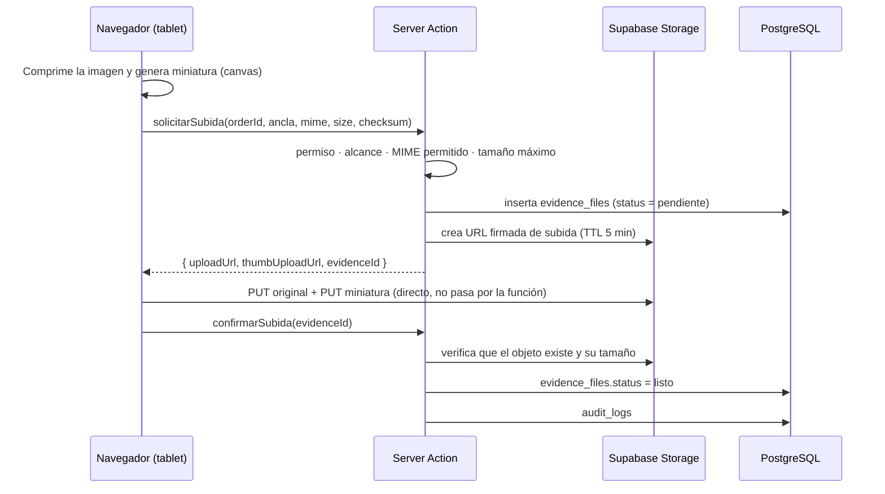

# 8. Diseño del almacenamiento de fotos y vídeos

## 8.1 Principio

Las fotografías de recepción y las evidencias de diagnóstico son **prueba frente
al cliente**. El diseño se decide desde ahí, no desde la comodidad:

1. **Ningún bucket es público.** Nunca (§52).
2. **La fila manda, no el archivo.** `evidence_files` es la fuente de verdad;
   un objeto en Storage sin fila es basura y se recolecta.
3. **Una lista nunca descarga un vídeo.** Ni una foto a resolución completa.
4. **El archivo se relaciona con el ítem exacto** (§16), no con la orden a secas.

## 8.2 Buckets

| Bucket | Contenido | Acceso |
| --- | --- | --- |
| `receptions` | Fotos de recepción, daños, firmas | Privado |
| `evidence` | Diagnóstico, reparación, calidad, recepción de repuestos | Privado |
| `documents` | PDFs generados (OS, cotización, acta, informes) | Privado |
| `branding` | Logos de clientes corporativos | Privado, URL firmada larga |

## 8.3 Convención de rutas

```
{bucket}/{corporate_client_id}/{service_order_id}/{ancla}/{entity_id}/{uuid}.{ext}
                                                                      └─ miniatura: {uuid}_thumb.webp
```

Ejemplo:

```
evidence/9f3a…/c1d2…/diagnostic_item/7b8c…/3e9f….jpg
evidence/9f3a…/c1d2…/diagnostic_item/7b8c…/3e9f…_thumb.webp
```

Empezar la ruta por `corporate_client_id` no es cosmético: permite que una
política de Storage corte por prefijo sin consultar tabla alguna, y hace trivial
exportar o purgar todo lo de un cliente corporativo cuando se va.

## 8.4 Recorrido de una subida



**El binario nunca atraviesa la función serverless.** Se sube directo a Storage
con una URL firmada de corta duración. Esto evita el límite de cuerpo de
petición de Vercel, no consume tiempo de función y permite vídeos de 200 MB sin
tocar nada.

La fila se crea **antes** de la subida y se confirma después. Un fallo a mitad
deja una fila `pendiente` sin objeto — detectable y recolectable — en vez de un
objeto huérfano que nadie sabe de quién es.

## 8.5 Miniaturas y rendimiento (§67)

| Tipo | Original | Miniatura | Cuándo se genera |
| --- | --- | --- | --- |
| Foto | JPEG/WebP, lado mayor ≤ 2560 px, calidad 0,82 | WebP 320 px | **En el cliente**, con `canvas`, antes de subir |
| Vídeo | Tal cual, ≤ 200 MB | Fotograma en el segundo 1, WebP 320 px | **En el cliente**, con `<video>` + `canvas` |
| Documento | PDF tal cual | Icono por tipo | — |

Generarlas en el cliente es una decisión deliberada: evita ejecutar
procesamiento de imagen en funciones serverless —lento, caro y con límites de
memoria— y además **reduce lo que se sube** desde una tablet con datos móviles
en un taller, que es donde el ancho de banda realmente escasea.

Reglas de la galería:

- Las listas piden **solo** `thumbnail_path`.
- La imagen completa se carga al abrir el visor.
- El vídeo muestra el póster; `preload="none"` hasta que el usuario pulsa.
- `loading="lazy"` + `IntersectionObserver`.
- Las URLs firmadas se piden **en lote** para lo visible, no una por archivo.

## 8.6 Validación de archivos (§66)

| Control | Regla |
| --- | --- |
| MIME permitido | `image/jpeg` · `image/png` · `image/webp` · `image/heic` · `video/mp4` · `video/quicktime` · `application/pdf` |
| Tamaño máximo | Imagen 10 MB · Vídeo 200 MB · Documento 20 MB |
| Extensión | Debe coincidir con el MIME declarado |
| Contenido | Comprobación de *magic bytes* en `confirmarSubida`: un `.exe` renombrado a `.jpg` no pasa |
| Integridad | `checksum_sha256` calculado en el cliente y verificado contra el objeto |
| Cuota | Máximo de archivos por ítem y por orden, configurable en `app_settings` |

## 8.7 Lectura: URLs firmadas

Nunca se expone una ruta de Storage. `POST /api/storage/signed-url` recibe uno o
varios `evidence_file_id` y, **para cada uno**:

1. comprueba sesión y permiso `evidence:read`;
2. comprueba que el `corporate_client_id` de la evidencia está en el alcance del
   usuario;
3. si el solicitante es el **portal del cliente**, exige además
   `is_client_visible = true`;
4. emite una URL firmada de **5 minutos**.

`is_client_visible` es la columna que hace cumplir §65: el técnico puede
adjuntar una foto de una pieza junto a una nota interna, y solo lo marcado como
compartible llega al cliente.

## 8.8 Ciclo de vida

| Situación | Qué ocurre |
| --- | --- |
| Se borra una evidencia | Borrado **lógico** (`deleted_at`). El objeto permanece. Queda en `audit_logs` quién y cuándo (§59) |
| Orden cerrada | Los archivos se conservan íntegros: §60 prohíbe eliminar el historial de una orden cerrada |
| Subida incompleta | Filas `pendiente` con más de 24 h → tarea de limpieza |
| Retención | Configurable por cliente corporativo; nunca por debajo del mínimo legal del contrato |
| Exportación | Un cliente corporativo puede pedir todo lo suyo: el prefijo de ruta lo hace una operación directa |
