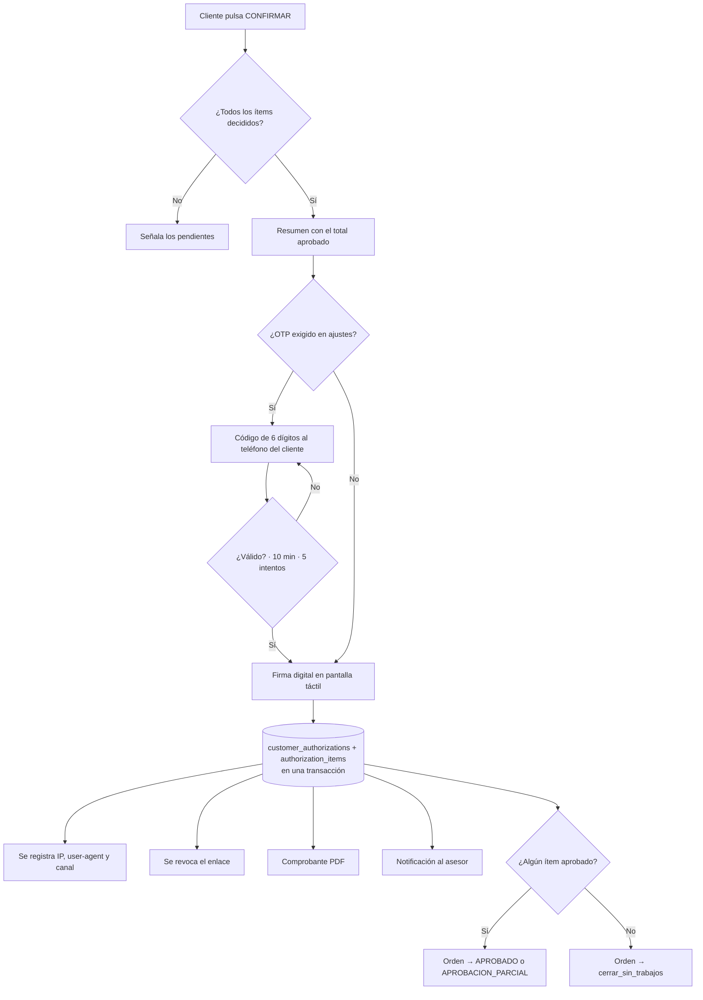

# 9. Estrategia de autorización del cliente

## 9.1 El problema

§3 establece que el cliente **no necesita usuario permanente**: recibe un enlace
seguro. Pero toda la seguridad del sistema descansa en RLS evaluando
`auth.uid()`, y un visitante anónimo no tiene `auth.uid()`.

Es la única superficie del sistema expuesta a internet sin autenticación, y
tiene delante datos personales y precios. Resolverlo "comprobando el token en la
Server Action" dejaría a la base de datos sin su última defensa justo donde más
falta hace. (Inconsistencia **I-1**.)

## 9.2 La solución: el rol `anon` no ve ninguna tabla

```sql
revoke all on all tables in schema public from anon;
grant execute on function public.portal_get_quotation(text)          to anon;
grant execute on function public.portal_submit_decisions(text,jsonb) to anon;
```

El portal lee y escribe **exclusivamente** a través de funciones
`SECURITY DEFINER` con `search_path` fijado, que:

1. calculan el hash del token recibido y lo buscan en `authorization_links`;
2. comprueban vigencia, revocación y número de usos;
3. devuelven **solo la proyección apta para el cliente**.

Aunque el código del portal tuviera un fallo, no existe consulta capaz de leer
una fila de más: el permiso de objeto no existe. **La frontera sigue estando en
la base de datos.**

## 9.3 El token

| Propiedad | Decisión |
| --- | --- |
| Generación | 32 bytes aleatorios de `crypto.randomBytes`, en base64url |
| Almacenamiento | **Solo `sha256(token)`**. Quien lea la tabla no puede reconstruir el enlace |
| Caducidad | 7 días, configurable en `app_settings` |
| Usos | `max_views` por defecto 50: un enlace reenviado eternamente es una fuga |
| Revocación | `revoked_at`; el asesor puede cortarlo en cualquier momento |
| Alcance | Una única cotización, una única versión |
| Rotación | Emitir la V2 revoca automáticamente el enlace de la V1 |

`/autorizacion/{token}` — el token va en la ruta, no en la query, para que no
acabe en los registros de *referrer* al abrir un enlace externo.

## 9.4 Qué ve y qué no ve el cliente (§65)

| Sí ve | No ve |
| --- | --- |
| Logo del taller y de su empresa | Costo de compra de los repuestos |
| Vehículo y placa (parcialmente protegida si se configura) | Proveedores y sus cotizaciones |
| Trabajo recomendado y prioridad, por ítem | Margen y utilidad |
| Evidencias marcadas `is_client_visible` | Notas privadas del técnico |
| Precio final por ítem, con impuesto | Otros clientes, otras órdenes |
| Totales: diagnosticado, aprobado, rechazado, pendiente | Datos internos del taller |

La exclusión no la decide el frontend: **la función SQL no selecciona esas
columnas**. Lo que no se selecciona no puede filtrarse por un error de
renderizado.

## 9.5 Decisión por ítem (§20–22)

Cada línea es independiente. El cliente puede aprobar pastillas, rechazar discos
y aprobar alineamiento en la misma cotización.

```
┌──────────────────────────────────────────────┐
│ Cambio de pastillas delanteras     S/  450.00│
│ Prioridad: ALTA        [ ver evidencia (3) ] │
│            ( APROBAR )      ( RECHAZAR )     │
├──────────────────────────────────────────────┤
│ Cambio de discos delanteros        S/  800.00│
│ Prioridad: MEDIA       [ ver evidencia (2) ] │
│            ( APROBAR )      ( RECHAZAR )     │
├──────────────────────────────────────────────┤
│ Alineamiento                       S/  120.00│
│ Prioridad: RECOMENDACIÓN                     │
│            ( APROBAR )      ( RECHAZAR )     │
└──────────────────────────────────────────────┘
  Diagnosticado S/ 1 370,00   Aprobado S/ 570,00
  Rechazado     S/   800,00   Pendiente S/   0,00
           [ CONFIRMAR AUTORIZACIÓN ]
```

Cada pulsación guarda de inmediato en `authorization_items` (así una conexión
que se cae en el taller no pierde las decisiones ya tomadas), pero **la
autorización no es firme hasta confirmar**.

### `aprobado_con_observacion` (resolución de **I-2**)

El cliente **nunca escribe importes ni cantidades** — eso convertiría el portal
en un formulario donde el cliente fija el precio. El estado significa *aprobado,
con una nota*: el ítem queda aprobado pero bloqueado para ejecución hasta que un
asesor marque la observación como atendida. Si la observación implica un cambio
real de alcance o precio, el camino es el de §61: **nueva versión de cotización**.

## 9.6 Confirmación



Todo ocurre en **una transacción**. No existe un estado intermedio en el que la
orden esté aprobada pero los ítems no, ni al revés.

Se registra, como pide §21: usuario o cliente, fecha, hora, IP, canal y
observaciones. El comprobante PDF se archiva en `documents` y queda disponible
para ambas partes.

## 9.7 Cuando el cliente no usa el portal

En un taller real muchas autorizaciones llegan por teléfono. El asesor las
registra con `authorizations:register`, y el sistema guarda
`channel = 'telefono' | 'presencial' | 'whatsapp'` junto con **quién la
registró**. Lo importante es que la fila deja claro que no fue el cliente quien
pulsó: una autorización telefónica y una firmada en el portal se distinguen para
siempre en la auditoría.

## 9.8 Defensa del endpoint público

| Amenaza | Defensa |
| --- | --- |
| Fuerza bruta sobre el token | 256 bits de entropía; límite de 10 intentos por IP cada 10 min; respuesta 404 genérica |
| Enumeración | El token no revela orden ni cliente; los fallos responden idéntico |
| Reenvío del enlace a terceros | Caducidad, `max_views`, revocación, y OTP al teléfono registrado cuando se exige |
| Repetición de la confirmación | `customer_authorizations` es única por `quotation_id`; el segundo intento devuelve el comprobante existente |
| Manipulación de importes | El cliente **no envía importes**: envía decisiones. El total se recalcula en el servidor desde `quotation_items` |
| Manipulación del `item_id` | La función comprueba que cada ítem pertenece a la cotización del token |
| Fuga por *referrer* | Token en la ruta, `Referrer-Policy: strict-origin-when-cross-origin`, `noindex` |
| Robo de sesión | El portal no crea sesión ni cookie de identidad |
