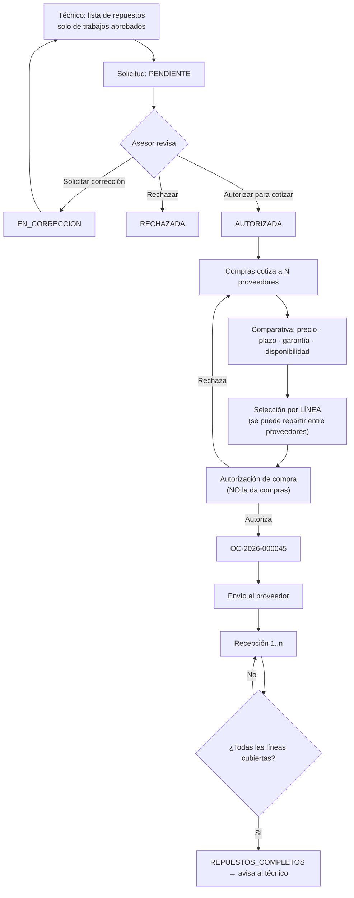

# 10. Lógica de repuestos, compras y recepción parcial

## 10.1 La cantidad requerida se deriva de lo aprobado

Es la regla que hace cumplir §60 —nunca comprar un repuesto asociado solo a un
trabajo rechazado— y resuelve la inconsistencia **I-4**.

Un repuesto puede servir a varios trabajos. La cantidad requerida es la suma de
los que **el cliente aprobó**:

```
requerido(p) = Σ  cantidad(p, i)
              i ∈ ítems de cotización con status ∈ {aprobado, aprobado_con_observacion}
```

Consecuencias directas:

- Un repuesto cuyos consumidores están **todos rechazados** tiene requerido 0 y
  la solicitud de compra **lo excluye**.
- Si el cliente aprueba 1 de 2 trabajos que usan el mismo filtro, se compra el
  del trabajo aprobado, no los dos.
- Comprarlo igualmente es posible, pero exige `purchases:override_scope` y deja
  registro en `audit_logs` con el motivo. Es una excepción visible, no un
  descuido silencioso.

```sql
-- Fuente única de la cantidad requerida
create view v_required_parts as
select qip.part_id, qi.quotation_id, q.service_order_id,
       sum(qip.quantity) as quantity_required
from quotation_item_parts qip
join quotation_items qi on qi.id = qip.quotation_item_id
join quotations q       on q.id  = qi.quotation_id
join authorization_items ai on ai.quotation_item_id = qi.id
where ai.status in ('aprobado','aprobado_con_observacion')
group by qip.part_id, qi.quotation_id, q.service_order_id;
```

## 10.2 Las seis cantidades de la trazabilidad (§62)

Cada repuesto lleva seis cantidades que **nunca se sobrescriben entre sí**:

| Cantidad | De dónde sale | Se calcula como |
| --- | --- | --- |
| `requerida` | Autorización del cliente | vista `v_required_parts` |
| `cotizada` | Compras | Σ `supplier_quote_items.quantity_available` de la línea seleccionada |
| `comprada` | Orden de compra | Σ `purchase_order_items.quantity_ordered` |
| `recibida` | Recepciones | **Σ `purchase_receipt_items.quantity_received`** |
| `instalada` | Reparación | Σ `repair_job_items.parts_installed` |
| `devuelta` | Devoluciones | Σ `purchase_receipt_items.quantity_rejected` |

**La recibida nunca es un contador que se incrementa.** Es siempre una suma
sobre las filas de recepción. Un contador acumulado se desincroniza en cuanto se
corrige una recepción; una suma, no. Es la misma decisión que se tomó con el
tiempo del técnico, y por la misma razón.

## 10.3 Cobertura y recepción parcial (§29)

```ts
// Puro, probado, sin base de datos.
lineCoverage(l)  = min(1, l.recibida / l.requerida)          // 0 si requerida = 0
orderCoverage(L) = Σ min(recibida, requerida) / Σ requerida  // para la barra
isComplete(L)    = L.filter(requerida > 0).every(recibida >= requerida)
```

Los dos últimos son **distintos a propósito**: la barra necesita un número
suave, pero el cambio de estado necesita un booleano estricto. "97 % recibido"
no permite empezar a reparar si lo que falta es el perno que sujeta la pieza.

### El ejemplo de §29, resuelto

Solicitado: pastillas 2 · filtros 3 · aceite 5.
Primera entrega: pastillas 2 · filtros 1 · aceite 5.

| Repuesto | Requerido | Recibido | Cobertura |
| --- | --: | --: | --: |
| Pastillas | 2 | 2 | **100 %** |
| Filtros | 3 | 1 | **33 %** |
| Aceite | 5 | 5 | **100 %** |
| **Orden** | 10 | 8 | **80 %** |

`isComplete = false` → la orden queda en `REPUESTOS_PARCIALES`. Aunque la barra
marque 80 %, el técnico **no** puede iniciar.

Segunda entrega, filtros 2 → todas las líneas cubiertas → `isComplete = true`
→ `REPUESTOS_COMPLETOS`, y se notifica al técnico.

### Reglas de las recepciones

- Una recepción **nunca modifica** una recepción anterior: se añade una fila.
- Una corrección es una fila con cantidad negativa y motivo, nunca un `UPDATE`.
- `quantity_received + quantity_rejected ≤ quantity_ordered` por línea: no se
  puede recibir más de lo comprado sin ampliar la OC.
- Se puede recibir de **varias órdenes de compra** para la misma orden de
  servicio: la cobertura se calcula por repuesto, no por OC.

## 10.4 Por qué `REPUESTOS_COMPLETOS` es el estado más importante del sistema

Es el instante desde el cual **se puede medir el tiempo real del técnico**
(§30–31). Antes de él, cualquier demora es de compras; después, del taller.

```
│←── espera del cliente ──→│←── espera de repuestos ──→│←── trabajo del técnico ──→│
COTIZACION_ENVIADA      APROBADO              REPUESTOS_COMPLETOS         REPARACION_TERMINADA
```

Si el cronómetro arrancara antes, un técnico impecable en un taller con compras
lentas aparecería como improductivo, y el indicador de §47 mediría exactamente
lo contrario de lo que pretende. Por eso `iniciar_trabajo` solo está disponible
desde `LISTO_PARA_REPARACION`, y a ese estado únicamente se llega con cobertura
completa o sin repuestos que esperar.

## 10.5 Recorrido de compras



**La selección es por línea, no por proveedor.** Si un proveedor tiene las
pastillas más baratas y otro entrega el filtro mañana en vez de el jueves, se
compra a los dos. Adjudicar la cotización entera a un proveedor obligaría a
elegir entre precio y plazo para todo el pedido, que es justo lo que §27 quiere
evitar al pedir comparación.

## 10.6 Comparación de proveedores (§27)

La tabla ordena por el criterio que el usuario elija, pero marca siempre dos
columnas distintas:

| | Proveedor A | Proveedor B | Proveedor C |
| --- | --- | --- | --- |
| Precio unitario | **S/ 180,00** ← mejor precio | S/ 195,00 | S/ 210,00 |
| Disponibilidad | 2 de 2 | 2 de 2 | 2 de 2 |
| Plazo | 4 días | **1 día** ← mejor plazo | 2 días |
| Garantía | 6 meses | 12 meses | **24 meses** |
| Forma de pago | 30 días | contado | 15 días |

Se destaca el mejor precio **y** el mejor plazo por separado, porque cuando el
vehículo está parado en la bahía el plazo suele valer más que la diferencia de
precio — y esa decisión debe tomarla una persona con ambos datos delante, no un
orden por defecto.

## 10.7 Reglas de negocio verificadas

| Regla (§60) | Dónde se hace cumplir |
| --- | --- |
| Nunca iniciar la reparación de un ítem rechazado | `repair_job_items` solo se crea para ítems aprobados; `CHECK` en la tabla |
| Nunca comprar un repuesto de un trabajo rechazado | `v_required_parts` filtra por autorización; excepción con permiso y auditoría |
| Nunca modificar en silencio una cotización aprobada | `quotations.status = 'emitida'` es inmutable; disparador rechaza el `UPDATE`; el cambio exige versión nueva |
| Nunca eliminar el historial de una orden cerrada | Sin política `DELETE` en ninguna tabla transaccional |
| Fotos y vídeos con relación exacta | `evidence_files` con FK reales y `CHECK` de ancla única |
