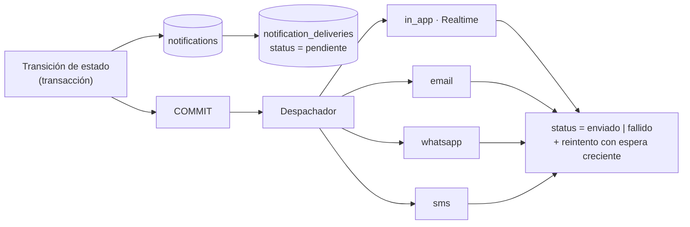

# 12. Estrategia de notificaciones

## 12.1 Principio: el evento se registra aunque el envío falle

El error clásico es enviar el WhatsApp dentro de la transacción que cambia el
estado. Si el proveedor responde lento o falla, o se pierde el aviso o se
revierte el cambio de estado. Ninguna de las dos cosas es aceptable.

Aquí se usa el patrón **outbox transaccional**:



La notificación se escribe **en la misma transacción** que el cambio de estado.
El envío por canales externos ocurre después y puede fallar y reintentarse sin
tocar nada del dominio. Consecuencia práctica: **el centro de notificaciones
interno nunca pierde un evento**, aunque el proveedor de WhatsApp esté caído.

## 12.2 Catálogo de eventos (§41)

| Código | Se dispara al | Destinatario por defecto |
| --- | --- | --- |
| `orden.asignada` | Asignar técnico | Técnico asignado |
| `diagnostico.completado` | `DIAGNOSTICO_COMPLETADO` | Asesor de la orden |
| `cotizacion.pendiente_envio` | `COTIZACION_EN_PREPARACION` > 2 h | Asesor |
| `cotizacion.enviada` | `COTIZACION_ENVIADA` | Asesor (acuse) |
| `cliente.abrio_enlace` | Primera apertura del portal | Asesor |
| `cliente.respondio` | Confirmación de autorización | Asesor |
| `cliente.sin_respuesta` | 24 h sin decisión | Asesor |
| `repuestos.solicitud_pendiente` | `SOLICITUD_REPUESTOS` | Asesor |
| `repuestos.compra_pendiente` | `COMPRA_PENDIENTE_AUTORIZACION` | Asesor / administrador |
| `repuestos.parciales` | Recepción parcial | Asesor · técnico |
| `repuestos.completos` | `REPUESTOS_COMPLETOS` | **Técnico** · asesor |
| `repuestos.atrasados` | OC vencida sin recibir | Compras · asesor |
| `tecnico.puede_iniciar` | `LISTO_PARA_REPARACION` | Técnico asignado |
| `reparacion.terminada` | `REPARACION_TERMINADA` | Calidad · asesor |
| `calidad.observada` | `OBSERVADO_CONTROL_CALIDAD` | Técnico · asesor |
| `calidad.aprobada` | `CONTROL_CALIDAD_APROBADO` | Asesor · lavado/alineamiento |
| `lavado.terminado` | `terminar_lavado` | Asesor |
| `alineamiento.terminado` | `terminar_alineamiento` | Asesor |
| `vehiculo.listo` | `LISTO_PARA_ENTREGA` | **Asesor** |
| `orden.riesgo_retraso` | ETA supera la hora prometida | Asesor |
| `encuesta.seguimiento` | Encuesta que requiere seguimiento | Asesor · analista |

El destinatario **no está en el código**: sale de `notification_rules`
(`event_code` → rol o destinatario calculado → canales). Cambiar quién recibe
qué es administración, no despliegue.

Ejemplo del texto de `vehiculo.listo`, tal como pide §40:

> **Orden OS-2026-000154 terminada.**
> Vehículo: Toyota Hilux · Placa: ABC-123
> El vehículo está listo para entrega.

## 12.3 Canales

| Canal | Estado | Implementación |
| --- | --- | --- |
| `in_app` | **Fase 18** | Tabla `notifications` + Supabase Realtime filtrado por destinatario |
| `email` | Preparado | Adaptador; proveedor por elegir |
| `whatsapp` | Preparado | Adaptador; WhatsApp Cloud API con plantillas aprobadas |
| `sms` | Preparado | Adaptador |

Todos implementan la misma interfaz, así que añadir un proveedor no toca el
dominio:

```ts
interface NotificationChannel {
  readonly code: ChannelCode;
  send(delivery: PendingDelivery): Promise<DeliveryResult>;
}
```

La elección de proveedor **no bloquea ninguna fase**: hasta que exista, el
despachador registra los envíos externos como `omitido` y el canal interno
funciona completo.

## 12.4 Reintentos y ruido

| Regla | Valor |
| --- | --- |
| Reintentos | 5, con espera creciente: 1 · 5 · 15 · 60 · 240 min |
| Agrupación | Varios eventos de la misma orden en 5 min → una sola notificación |
| Repetición | Un mismo evento no se reemite para la misma orden |
| Silencio | Los canales externos respetan el horario del taller; `in_app` siempre |
| Preferencias | Por usuario y por canal |

La regla de agrupación existe porque un tablero que avisa doce veces por orden
se silencia en una semana, y entonces no avisa de nada.

## 12.5 Lo que no se notifica

Deliberadamente **no** se emite notificación de: cada foto subida, cada línea de
cotización editada, cada guardado de checklist ni cada cambio de cantidad. Todo
eso queda en `audit_logs` y en la línea de tiempo, donde se consulta cuando hace
falta. Una notificación es una **petición de acción**; si no hay nada que hacer,
no es una notificación: es ruido.
