# 15. Plan completo de implementación

Las dos especificaciones traían planes distintos —12 fases y 24 fases— que se
solapaban. Aquí se unifican en **16 fases**. Ninguna entrega se ha perdido: la
correspondencia está en §15.3.

## 15.1 Regla de cierre de fase

Una fase **no está terminada** hasta que:

```
npm run typecheck    → sin errores
npm run lint         → sin errores
npm run test         → sin fallos
npm run build        → compila
```

más el criterio propio de la fase, y el resultado se reporta. No se avanza a la
siguiente sin dejar la anterior funcional.

## 15.2 Las 16 fases

| # | Entrega | Terminada cuando |
| :-: | --- | --- |
| **1** | **Arquitectura, estructura, máquina de estados y dominio puro** | Compila y lint limpio · `/api/health` responde · navegación recorrible con los cuatro estados · máquina de estados y cálculos de progreso/ETA/semáforo probados sin base de datos |
| 2 | Modelo PostgreSQL: 66 tablas, índices, funciones de seguridad, **RLS**, permisos de objeto, seeds de catálogo y DEMO | Migraciones aplicadas sobre PostgreSQL real · catálogo sembrado · **aislamiento corporativo demostrado con dos usuarios** en `db/tests/` |
| 3 | Autenticación, usuarios, roles y permisos | Cada rol entra y solo ve lo suyo · permisos leídos de `role_permissions` · limitación de intentos · registro en `audit_logs` |
| 4 | Empresas, sedes, bahías, clientes y vehículos · **búsqueda universal** | Alta, edición y baja lógica con auditoría · placa → ficha · DNI enmascarado · búsqueda por los ocho criterios de §57 |
| 5 | **Recepción y checklist digital** | Formulario completo en tablet · checklist leído de catálogo · niveles y cocadas · documentos · firmas · orden generada automáticamente |
| 6 | **Diagrama de daños, fotografías y evidencias** | Marcado sobre el esquema del vehículo · cámara desde tablet y móvil · subida directa a Storage con miniatura · evidencia atada al ítem exacto |
| 7 | **Orden de servicio, asignación y línea de tiempo** | Máquina de estados operando contra la base con disparador · asignación con disponibilidad y bahía · línea de tiempo completa |
| 8 | **Diagnóstico técnico** | Ítems con sistema, hallazgo, prioridad y horas · evidencias por ítem · notificación al asesor |
| 9 | **Cotización versionada** | Líneas independientes · totales en vivo · V1…Vn con la anterior congelada · PDF de cotización |
| 10 | **Portal de autorización del cliente** | Enlace firmado · decisión por ítem · OTP y firma · comprobante · solo los aprobados vuelven al técnico · los rechazados bloqueados |
| 11 | **Repuestos y compras** | Cantidad requerida derivada de lo aprobado · solicitud y revisión · comparación de proveedores · OC · **recepción parcial y total** · `REPUESTOS_COMPLETOS` automático |
| 12 | **Control de tiempos y reparación** | Cronómetro con marcas del servidor · pausas con motivo · bruto/pausas/efectivo · **progreso y ETA en vivo** · ampliación a cotización V2 |
| 13 | **Calidad, lavado, alineamiento y entrega** | Checklist de calidad con rechazo y reintento · etapas finales según configuración · acta de entrega firmada · cierre |
| 14 | **Notificaciones y tableros** | Centro de notificaciones con Realtime · outbox listo para canales externos · control tower · tableros de asesor, técnico y compras · **semáforo automático** |
| 15 | **Satisfacción y analítica** | Encuesta desde la orden entregada · CSAT/NPS/índice almacenados · panel con filtros en URL · doce visualizaciones · comparativa contra periodo anterior · indicadores de productividad §47–48 |
| 16 | **Documentos, auditoría, pruebas y despliegue** | Los nueve PDFs · las dos plantillas Excel · pantalla de auditoría · consultas medidas con `EXPLAIN ANALYZE` · pruebas de los siete tamaños de pantalla · producción en Vercel |

### Dependencias

```mermaid
flowchart LR
    F1["1 · Arquitectura"] --> F2["2 · Base de datos"]
    F2 --> F3["3 · Auth y roles"]
    F3 --> F4["4 · Maestros"]
    F4 --> F5["5 · Recepción"]
    F5 --> F6["6 · Evidencias"]
    F5 --> F7["7 · Orden y estados"]
    F6 --> F8["8 · Diagnóstico"]
    F7 --> F8
    F8 --> F9["9 · Cotización"]
    F9 --> F10["10 · Portal cliente"]
    F10 --> F11["11 · Repuestos y compras"]
    F11 --> F12["12 · Tiempos y reparación"]
    F12 --> F13["13 · Calidad y entrega"]
    F13 --> F14["14 · Notificaciones y tableros"]
    F13 --> F15["15 · Satisfacción"]
    F14 --> F16["16 · Documentos y despliegue"]
    F15 --> F16
```



La ruta crítica es 5 → 7 → 8 → 9 → 10 → 11 → 12 → 13: es el recorrido del
vehículo, y no admite atajos porque cada fase produce los datos que consume la
siguiente. Las fases 6, 14 y 15 pueden solaparse con sus vecinas.

## 15.3 Correspondencia con los planes originales

Para verificar que no se ha perdido ninguna entrega:

| Plan de 24 fases (operación) | Aquí |
| --- | :-: |
| 1 Arquitectura, modelo y estados | 1 + 2 |
| 2 Autenticación y roles | 3 |
| 3 Clientes y vehículos | 4 |
| 4 Recepción y checklist | 5 |
| 5 Diagramas de daños y fotografías | 6 |
| 6 Órdenes de servicio | 7 |
| 7 Área técnica y diagnóstico | 8 |
| 8 Evidencias | 6 |
| 9 Cotizaciones | 9 |
| 10 Portal de autorización | 10 |
| 11 Solicitud de repuestos · 12 Compras · 13 Recepción parcial | 11 |
| 14 Control de tiempos · 15 Proceso técnico | 12 |
| 16 Control de calidad · 17 Lavado y alineamiento | 13 |
| 18 Notificaciones · 19 Dashboards | 14 |
| 20 Documentos PDF y Excel | 16 |
| 21 Analytics | 15 |
| 22 Auditoría · 23 Testing · 24 Deployment | 16 |

| Plan de 12 fases (satisfacción) | Aquí |
| --- | :-: |
| 1 Arquitectura y estructura | 1 |
| 2 Modelo, índices y RLS | 2 |
| 3 Autenticación, usuarios, roles | 3 |
| 4 Empresas, clientes y vehículos | 4 |
| 5 Buscador por placa | 4 |
| 6 Formulario de encuesta · 7 Persistencia y CSAT/NPS | 15 |
| 8 Panel y filtros · 9 Gráficos y comparativas | 15 |
| 10 PDF | 16 |
| 11 Panel administrativo | 3 + 4 + 16 |
| 12 Auditoría, optimización, pruebas, despliegue | 16 |

## 15.4 Qué entrega exactamente la Fase 1

Para que el criterio de cierre sea verificable y no interpretable:

| Entregable | Comprobación |
| --- | --- |
| Los 17 documentos de arquitectura | `docs/` |
| Proyecto Next.js 16 con TypeScript estricto | `npm run typecheck` |
| Sistema de diseño: tokens Tailwind v4 y primitivos de interfaz | `/` renderiza con la identidad definida |
| `AppShell` con barra lateral y superior, navegación por rol | Todas las rutas del §7 recorribles |
| Los cuatro estados de pantalla en componentes reutilizables | `components/feedback/` |
| **Máquina de estados completa** (34 estados, 39 transiciones) | `npm run test` |
| **Progreso, ETA y semáforo** como funciones puras | `npm run test` |
| **Cobertura de repuestos** como función pura | `npm run test` |
| Catálogo de permisos y matriz de roles (semilla) | `src/lib/auth/permissions.ts` |
| Jerarquía de errores y `ActionResult<T>` | `src/lib/errors/` |
| Validación del entorno con Zod | `src/lib/env.ts` |
| `/api/health` | Responde sin sesión |
| Regla de lint que aísla el dominio puro | `npm run lint` |

**Lo que la Fase 1 deliberadamente NO hace:** no crea tablas, no conecta con
Supabase, no autentica. Las pantallas muestran su estructura real con datos de
ejemplo marcados como tales. Eso es la Fase 2 y la 3, y mezclarlo aquí
significaría entregar una fase a medias — que es exactamente lo que la regla 1
prohíbe.
